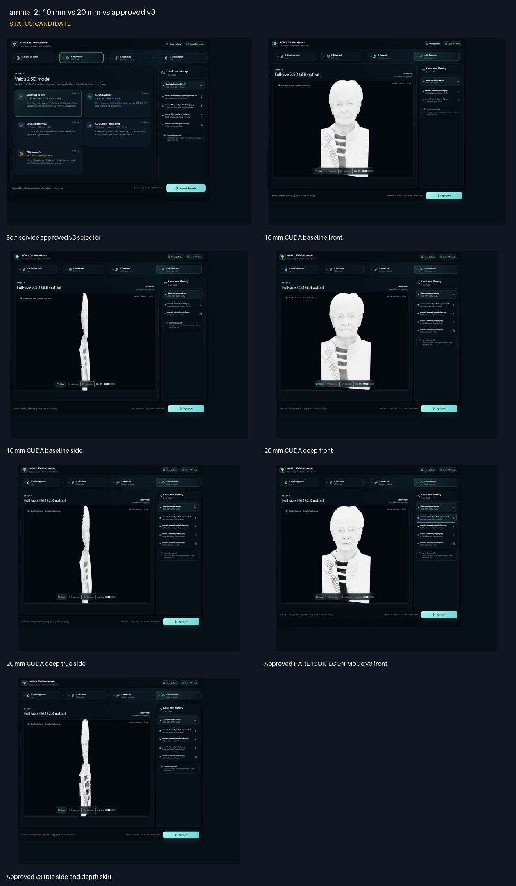
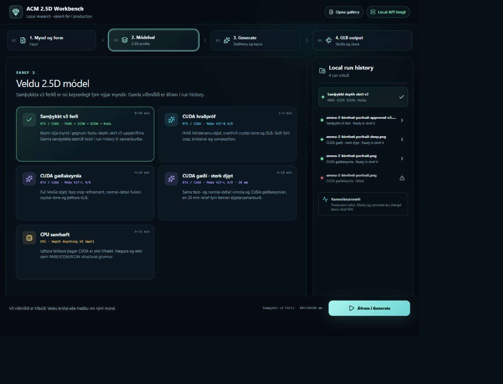
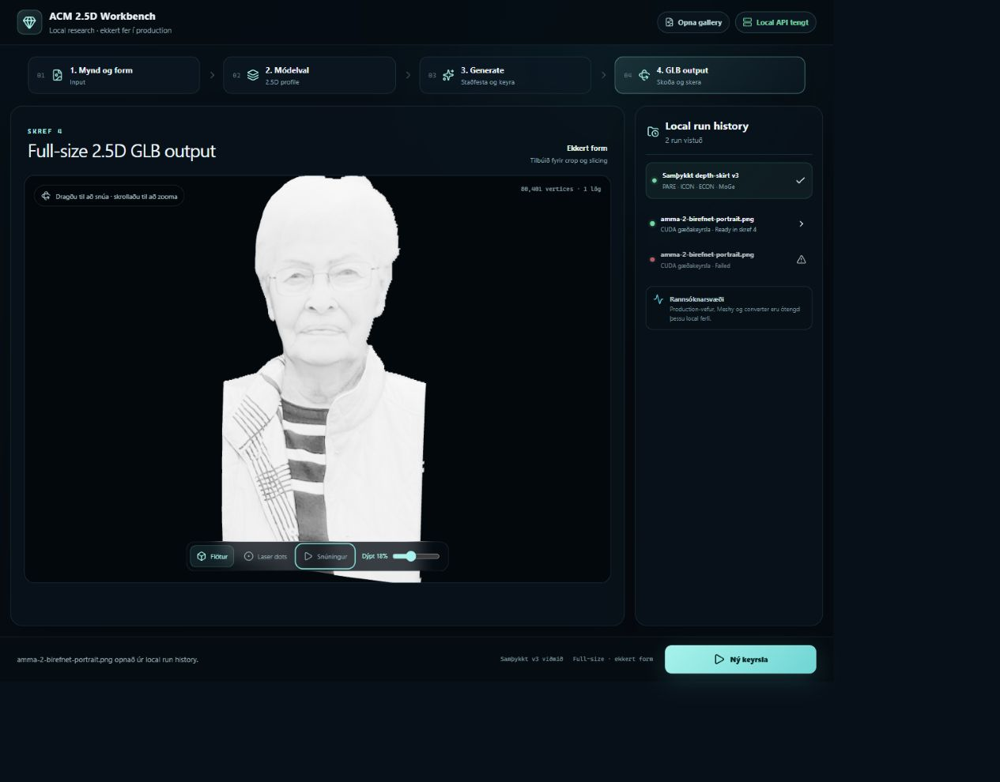
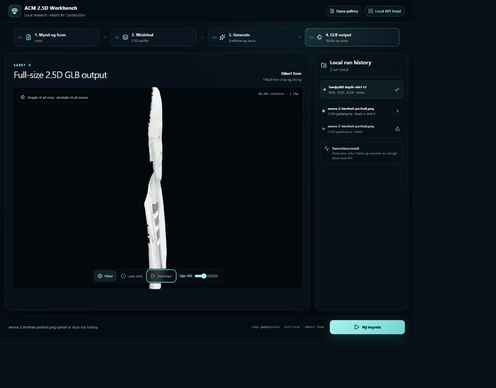
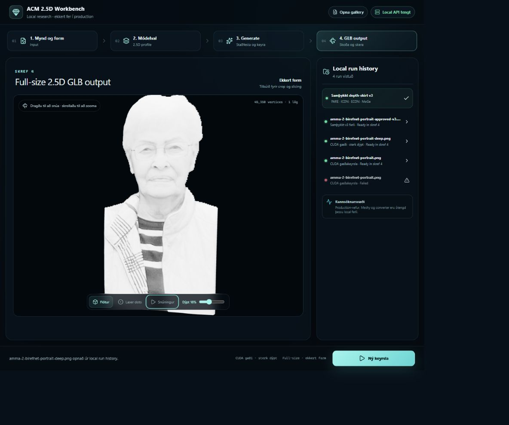
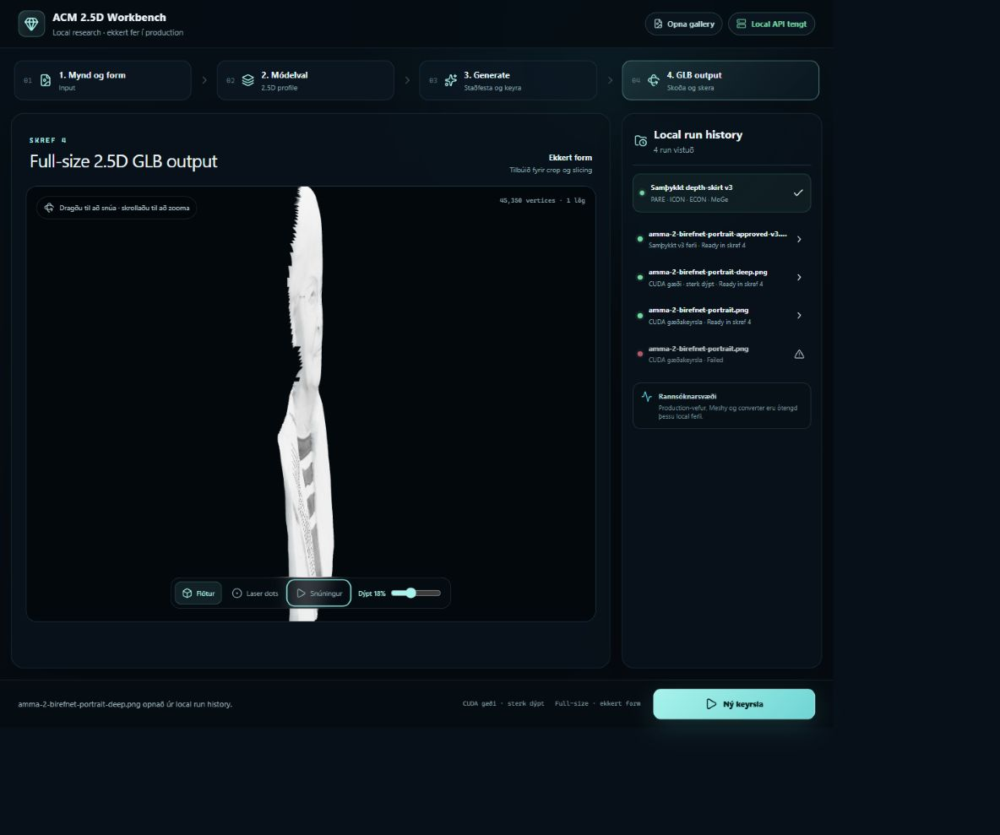
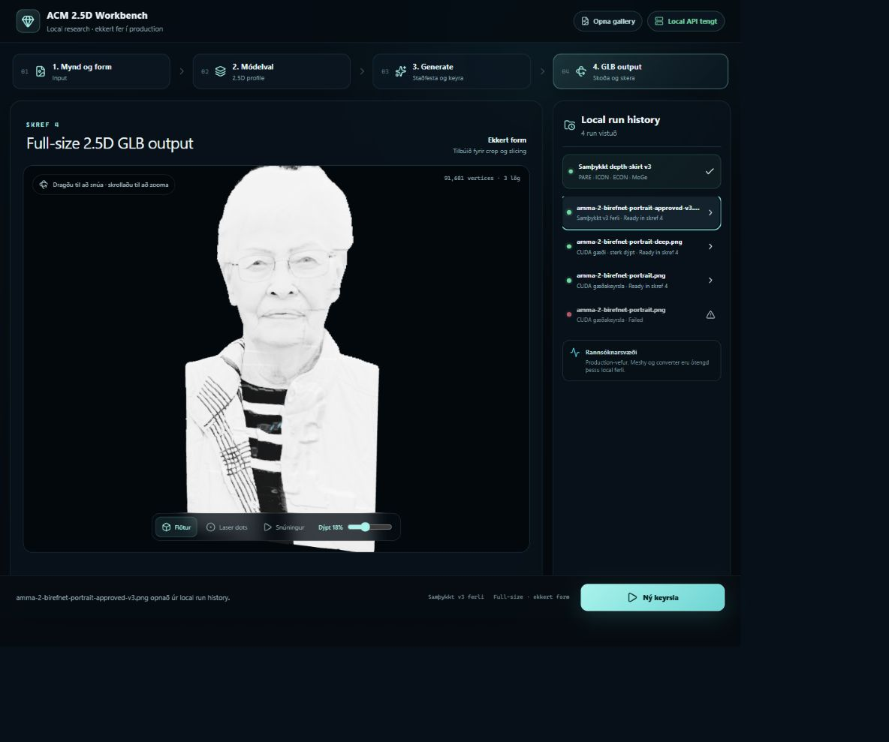
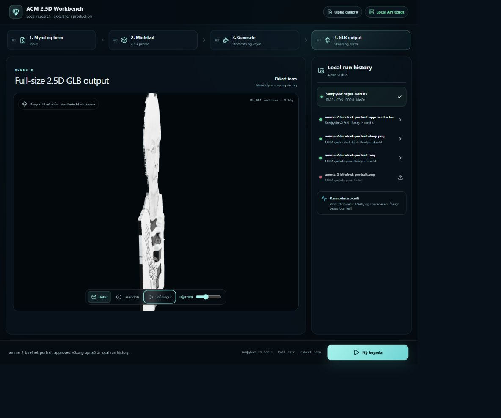

# amma-2: 10 mm vs 20 mm vs approved v3

Status: **CANDIDATE**

## Notes

- All three candidates use the same BiRefNet portrait cut-out 898dfc7155e0.
- 20 mm CUDA job: 1fa37434dc03, 45,350 vertices and 89,578 triangles.
- Approved-v3 job: 8a928842c81f, 91,681 vertices and 178,622 triangles across three layers.
- Approved-v3 person detection score: 0.999375; source-camera median registration error: 0.255 px.
- Candidate comparison only; the immutable two-person v3 reference was not overwritten.

## Self-service approved v3 selector

## 10 mm CUDA baseline front

## 10 mm CUDA baseline side

## 20 mm CUDA deep front

## 20 mm CUDA deep true side

## Approved PARE ICON ECON MoGe v3 front

## Approved v3 true side and depth skirt

