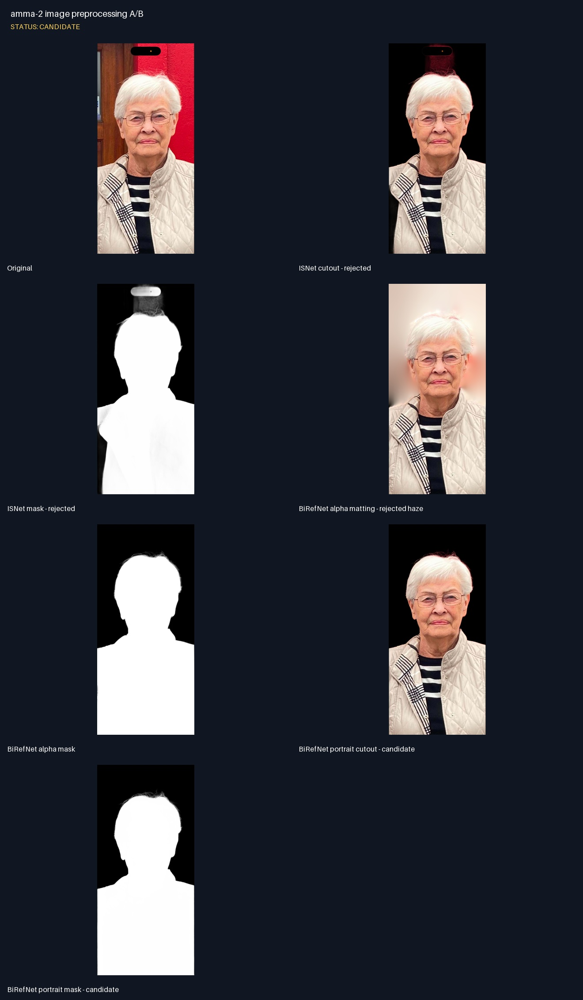
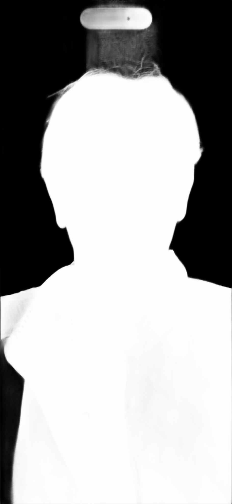
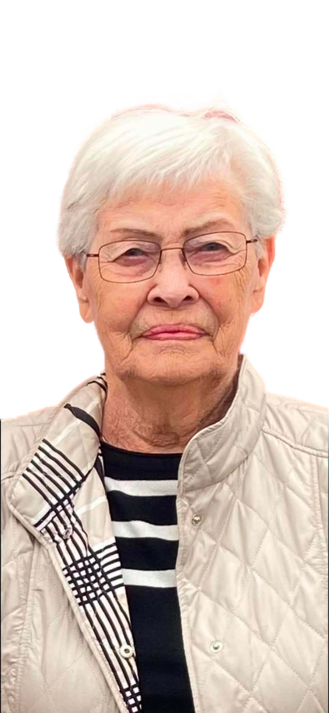
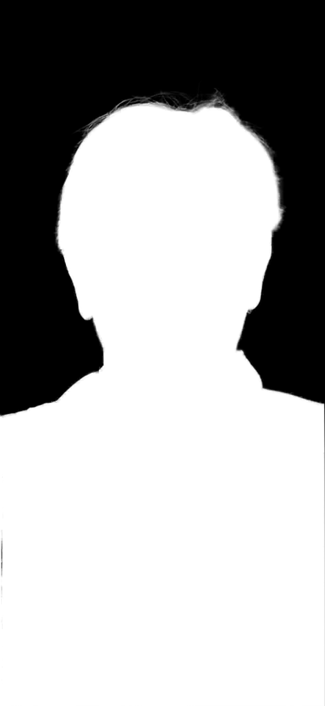

# amma-2 image preprocessing A/B

Status: **CANDIDATE**

## Notes

- ISNet kept the phone overlay and red wall above the head.
- BiRefNet with alpha matting removed the object but left translucent background haze.
- BiRefNet portrait without alpha matting is the selected input for the next 2.5D run.
- No face enhancement was applied; likeness remains source-derived.

## Original

## ISNet cutout - rejected

## ISNet mask - rejected

## BiRefNet alpha matting - rejected haze

## BiRefNet alpha mask

## BiRefNet portrait cutout - candidate

## BiRefNet portrait mask - candidate

