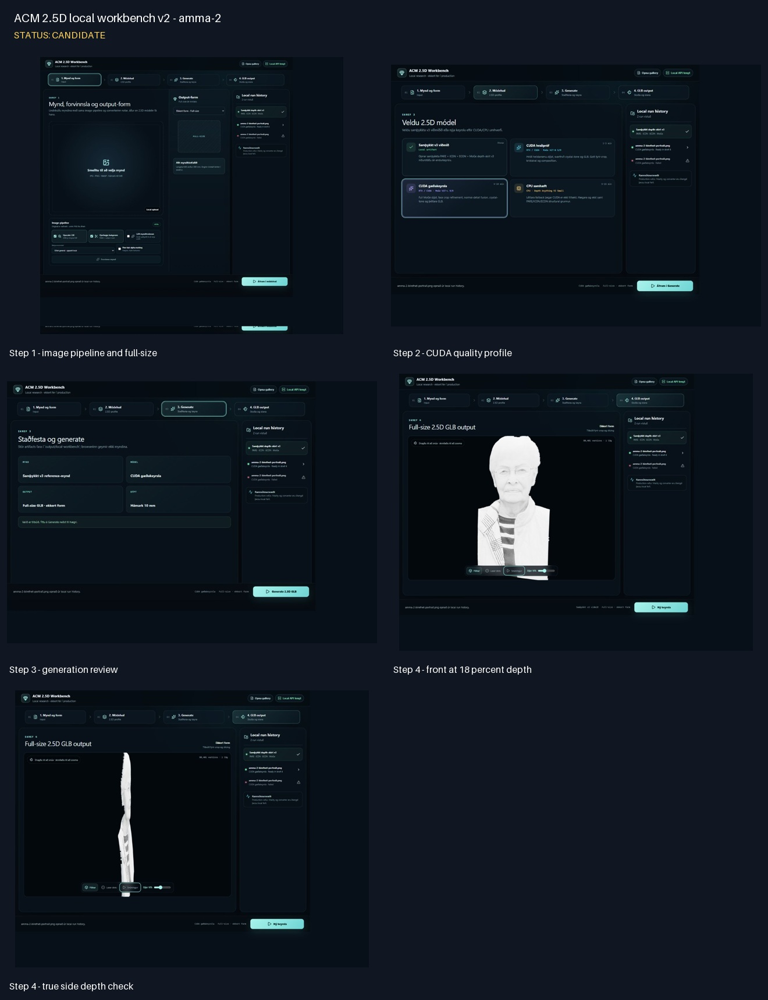

<!--
File: .Markdown/runs/2026-09-02-local-2.5d-workbench-v2/README.md
Purpose:
 - Record the four-step local workbench and the first amma-2 CUDA candidate.
-->

# Run: local workbench v2 + `amma-2`

Status: **candidate**.

Þessi keyrsla staðfestir nýja local-only flæðið:

1. myndvinnsla og output-form;
2. val á 2.5D módeli/keyrslusniði;
3. staðfesting og generation;
4. GLB output viewer.

Production-vefurinn, Meshy, image enhancer og converter-job flæðin eru áfram
ótengd rannsóknarvefnum.

## Myndvinnsla

- Source: `input-testers/amma-og-afi/amma-2.jpeg`.
- Valin forvinnsla: 2048 px upscale og `BiRefNet portrait` án alpha matting.
- Local preprocess ID: `898dfc7155e0`.
- Ástæða: síma-overlay og rauður veggur fóru, en silhouette, axlir og hár héldust
  betur en í ISNet- og alpha-matting samanburðunum.

## CUDA candidate

- Local job ID: `77bd24a3e3c1`.
- Profile: `cuda-quality`, MoGe ViT-L 9/9.
- Full-size blank: `138.57 × 300 × 60 mm`.
- Relief: `136.57 × 296.29 × 10.00 mm`.
- Mesh: `80,401` vertices og `159,278` triangles.
- Face landmarks: eitt andlit, 468 MediaPipe landmarks.
- Viewer: `18%` dýpt, ekkert kristalform.

Framhliðin varðveitir andlitsdrætti vel. Hliðarsýn staðfestir að dýptin er miklu
minni en eldri viewer-stillingin. Þetta er þó ekki loka edge-geometry: multi-ring
v5/hybrid-v6 glide verður næsta samanburðarpróf til að slétta silhouette-kantinn.

Sjá [artifact skrá](ARTIFACTS.md) og
[background-removal samanburð](../2026-09-02-amma-2-image-preprocess/README.md).

