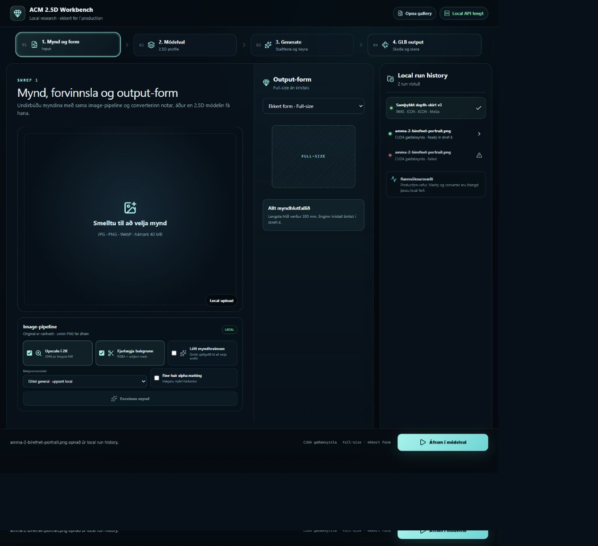
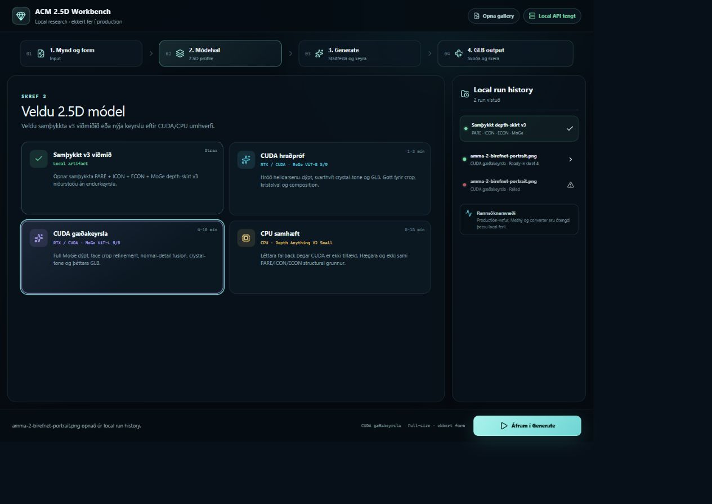
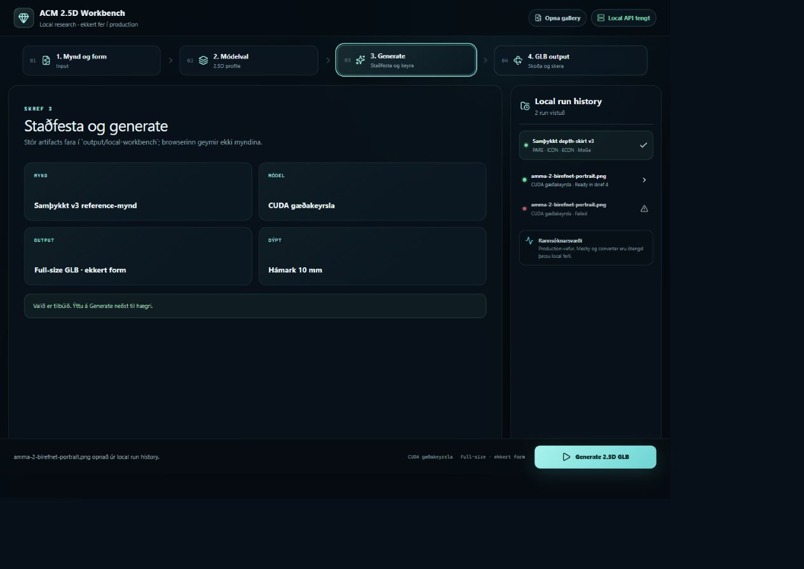

# ACM 2.5D local workbench v2 - amma-2

Status: **CANDIDATE**

## Notes

- Source: amma-2.jpeg, preprocessed with BiRefNet portrait without alpha matting.
- CUDA quality run 77bd24a3e3c1 produced 80,401 vertices and a 10.0 mm relief.
- Full-size output uses no crystal geometry; viewer depth is 18 percent.
- Candidate only: multi-ring hybrid v6 edge glide remains the next geometry experiment.

## Step 1 - image pipeline and full-size

## Step 2 - CUDA quality profile

## Step 3 - generation review

## Step 4 - front at 18 percent depth

## Step 4 - true side depth check

