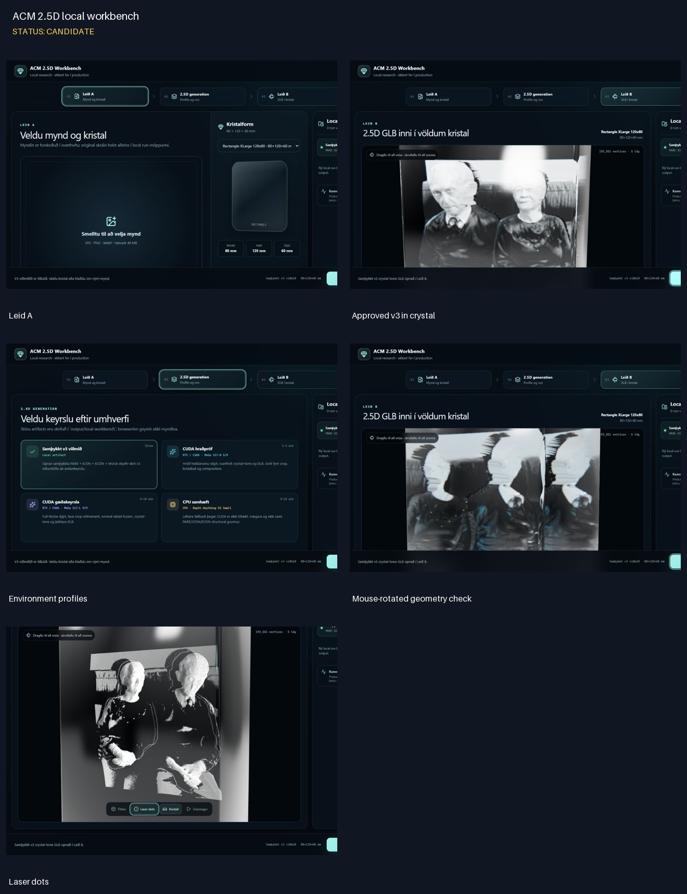
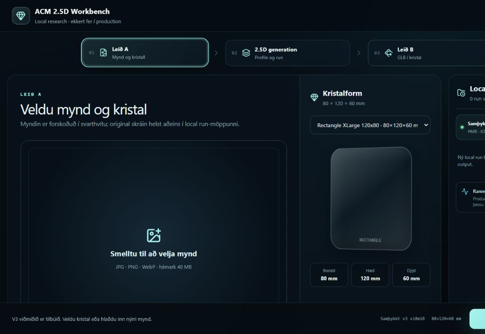
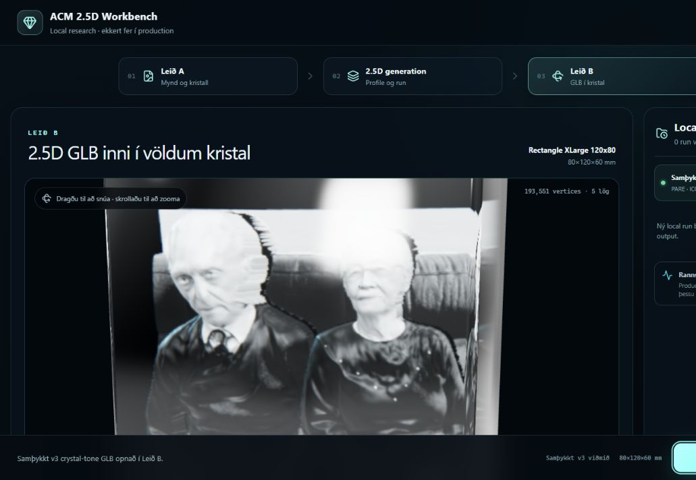
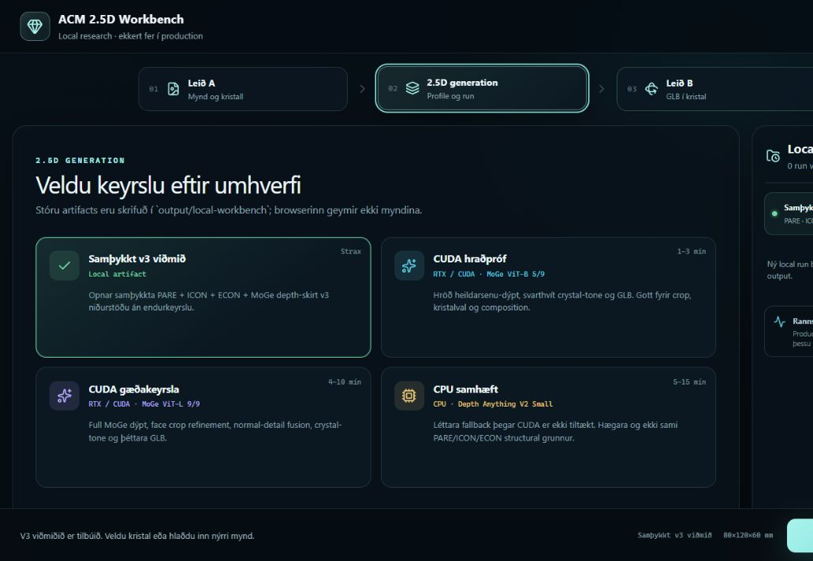
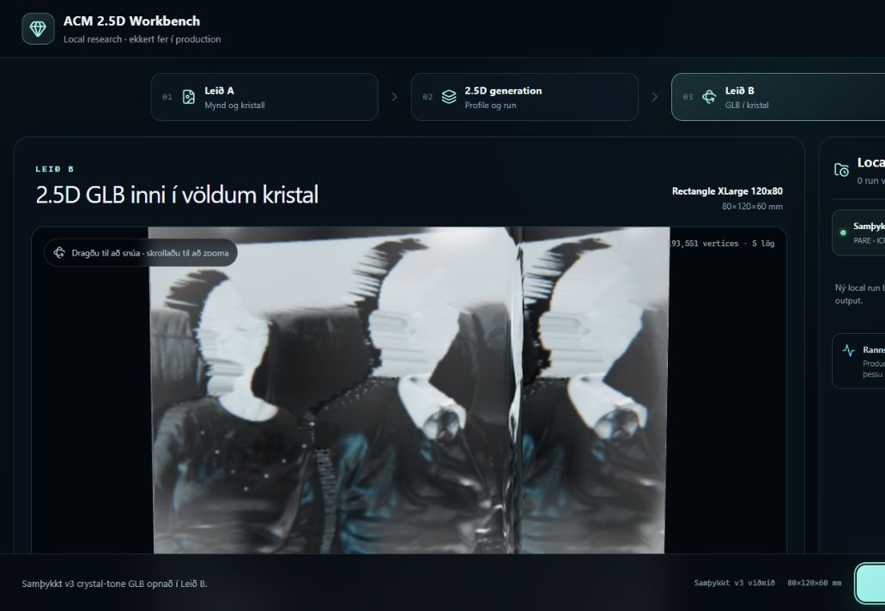
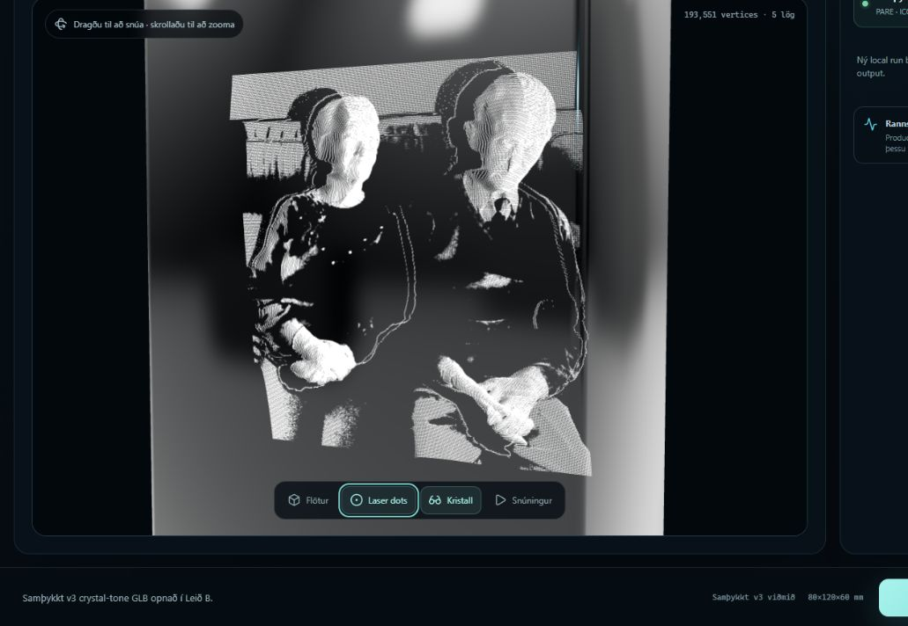

# ACM 2.5D local workbench

Status: **CANDIDATE**

## Notes

- Local-only workflow: Leid A to 2.5D generation to Leid B.
- Viewer loads the approved crystal-tone v3 GLB: 193,551 vertices across five layers.
- Fresh-browser console check returned zero errors or warnings after the clean restart.

## Leid A

## Approved v3 in crystal

## Environment profiles

## Mouse-rotated geometry check

## Laser dots

