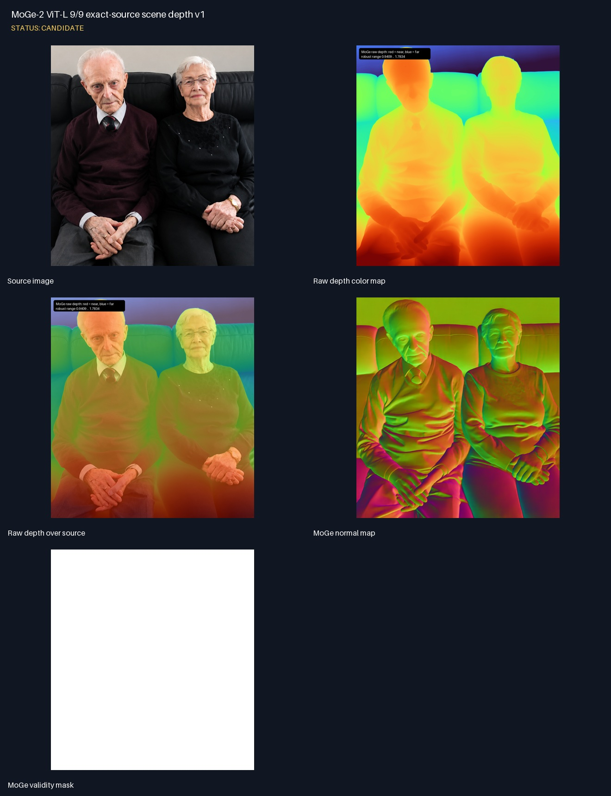

<!--
File: .Markdown/runs/2026-09-02-moge-exact-source-both-together/README.md
Purpose:
 - Freeze MoGe-2 ViT-L scene depth from the exact approved PARE source image.
-->

# Run: MoGe-2 ViT-L 9/9 á exact source

## Niðurstaða

MoGe-2 ViT-L 9/9 var keyrt á nákvæmlega sömu 1086×1177
`both_together.png` og PARE/ICON runnið. Þetta kemur í stað þess að reyna að
sameina eldri MoGe output úr annarri 2800×2002 crop/appearance mynd.

Runnið er **candidate** fyrir sófa, bakgrunn, fætur/neðri mynd og global depth
anchor. Það má ekki yfirskrifa samþykkta human geometry.

## Artifacts og mælingar

- Hrátt float32 depth: `depth_raw.npy`, 1177×1086, allt finite.
- Raw depth range: 0,896762–1,822115; minna gildi er nær.
- Robust p01/p50/p99: 0,940915 / 1,250274 / 1,783442.
- Normal, validity mask, 16-bit bright=near preview og color QA varðveitt.

## Gallery



Full-resolution local gallery:

```text
output/research/scene-depth/both-together-ai-enhanced-moge2-vitl-level9-v1/artifacts/gallery/
```

Sjá [artifact skrá](ARTIFACTS.md).
