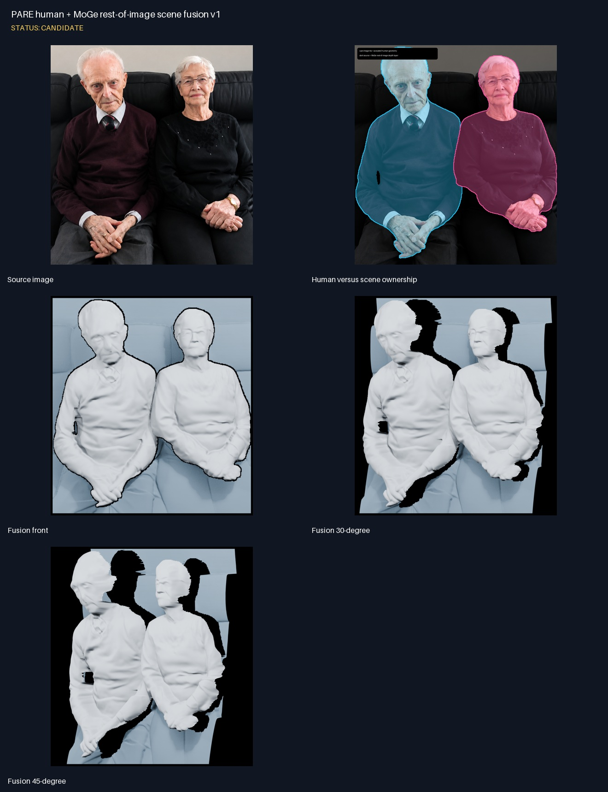
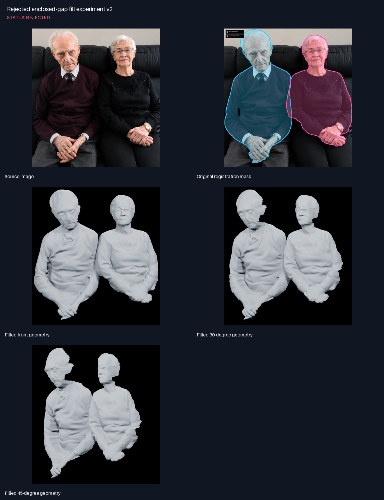
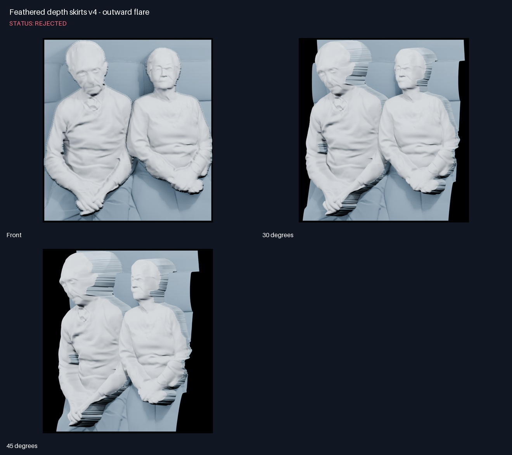
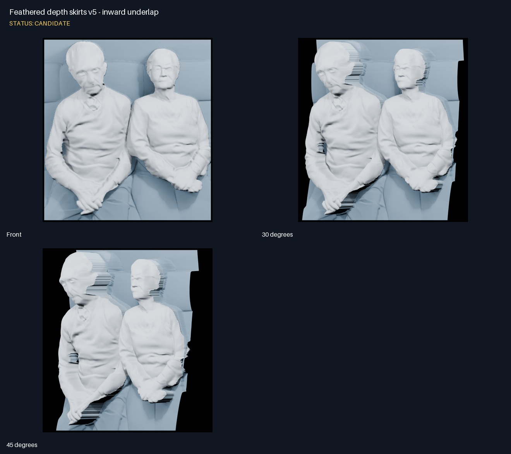

<!--
File: .Markdown/runs/2026-09-02-scene-fusion-and-depth-skirts/README.md
Purpose:
 - Record human/scene layer fusion and the first measurable silhouette depth-skirt variants.
-->

# Run family: PARE human + MoGe scene + depth skirts

## Human/scene fusion v1 — candidate

Samþykkt PARE+ICON+ECON geometry á human-maskinu var sameinuð MoGe-lagi fyrir
restina af myndinni. MoGe scene mesh notar stride 3 og 0,35 scene-unit robust
depth span. Human local depth er óbreytt; MoGe gaf aðeins litla global offseta:
maður +0,005873, kona −0,010043 scene-units.

- Scene: 60.134 vertices / 116.702 triangles.
- Combined: 186.246 vertices / 365.952 triangles.
- Náttúrulega arm-bilið helst opið og sýnir MoGe-lagið aftar.
- 30°/45° QA sýndi að formlegt backfill vantaði við silhouette.



## Rejected gap-fill v2

Tilraun til að fylla arm-bilið var hafnað af notanda: bilið er raunverulegt
occlusion-bil. Global d-BiNI re-integration jók einnig dýpt manns úr 0,523745 í
0,842873 og myndaði óæskilega rauf. Kóðaleiðin var fjarlægð; evidence er geymt.



## Depth-skirt v3 — accepted reference

Hver boundary-edge fær back-duplicate við sampled MoGe depth og tvö triangles
sem mynda stýrða útlínustrekkingu. Innri arm-opnunin er ekki fyllt; hún fær sinn
eigin jaðar sem teygist aftur og sýnir scene-lagið fyrir aftan.

- Maður: 1.568 boundary edges / 3.136 skirt triangles.
- Kona: 1.404 boundary edges / 2.808 skirt triangles.
- Combined: 193.551 vertices / 374.592 triangles.
- 0 px scene clearance var betra en 2 px variant.
- Notandinn samþykkti formið sem núverandi gullviðmið og staðfesti að innra
  arm-bilið sé rétt náttúrulegt bil, ekki hola sem á að loka.
- Ytri back-edge join og lárétt banding eru áfram refinement-markmið án þess að
  breyta samþykkta v3 artifactinu.


## Feathered depth-skirt v4 — rejected

Fyrsta multi-ring feathering tilraunin teygði kantinn út frá silhouette. Hún
sléttaði hluta jaðarsins en myndaði sýnilegan ljósan halo framan frá og hélt
láréttum þrepum í skáhornum. Hún er varðveitt sem neikvætt evidence.



## Feathered depth-skirt v5 — candidate

V5 snýr feathering inn undir samþykkta framflötinn og lætur scene-lagið ná
9 px undir silhouette. Það hreinsar framkantinn verulega án þess að loka
náttúrulega arm-bilinu. 30°/45° QA sýnir þó enn lárétt stair-bands, þannig að
v5 leysir ekki v3 af hólmi enn.

- Feather width: 6 px inn á við.
- Scene sample offset: 3 px út á við.
- 12 rings og 80 depth-smoothing iterations.
- Combined: 229.772 vertices / 446.974 triangles.



## Local galleries

```text
output/research/scene-fusion/pare-icon-econ-moge2-both-together-v1/artifacts/gallery/
output/research/source-camera-fusion/both-together-ai-enhanced-pare-repaired-v2/artifacts/gallery/
output/research/scene-fusion/pare-icon-econ-moge2-clearance0-depth-skirts-v3/artifacts/gallery/
output/research/scene-fusion/pare-icon-econ-moge2-clearance0-feathered-depth-skirts-v4/artifacts/gallery/
output/research/scene-fusion/pare-icon-econ-moge2-underlap9-feathered-v5/artifacts/gallery/
```

Sjá [artifact skrá](ARTIFACTS.md).
