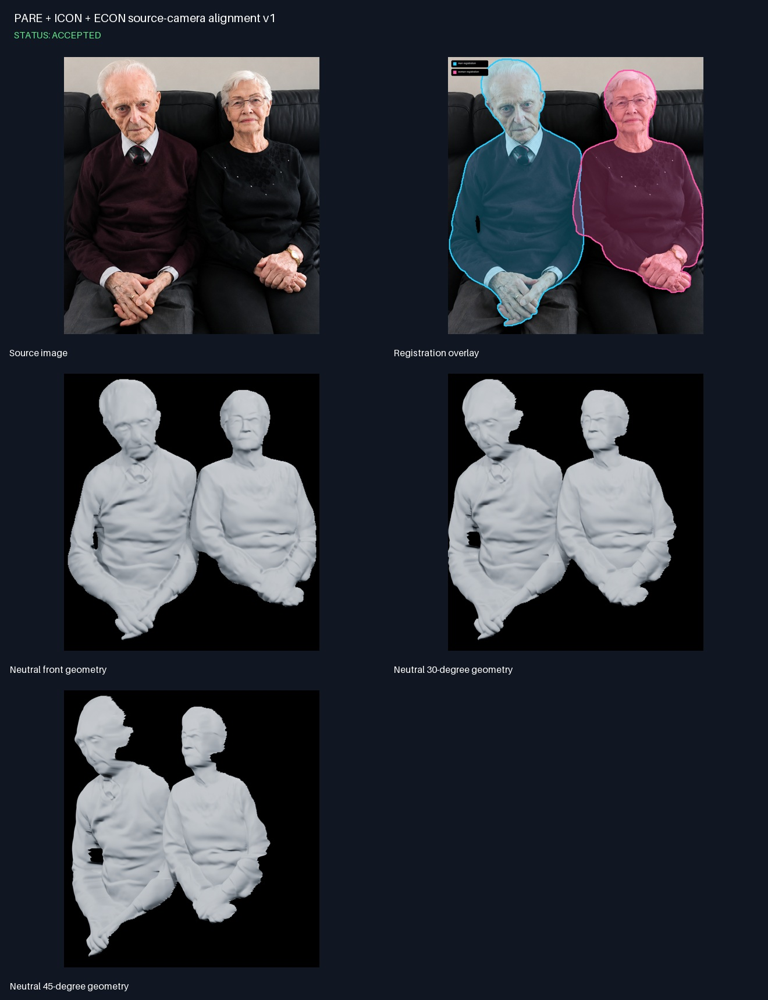

<!--
File: .Markdown/runs/2026-09-02-source-camera-pare-both-together/README.md
Purpose:
 - Freeze the user-approved source-camera registration of the PARE/ICON/d-BiNI surfaces.
-->

# Run: samþykkt PARE source-camera fusion

## Niðurstaða

Vinnings-PARE flötum manns og konu var varpað úr hvoru 512×512 ICON-hnitarými
aftur í sameiginlega 1086×1177 source camera. Pixel aspect ratio, vertex colors
og samþykkt local depth voru varðveitt.

Notandi samþykkti þessa geometry sem structural baseline. Sýnilega bilið milli
vinstri handleggs/olnboga mannsins og bols er raunverulegt occlusion-bil og á að
halda sér. Fine face/hair/glasses/detail kemur síðar frá region-specific líkönum.

## Registration

| Subject | Inliers | Inlier ratio | Median error | Scale |
|---|---:|---:|---:|---:|
| Maður | 116/118 | 98,3% | 0,176 px | 2,503274 |
| Kona | 100/100 | 100% | 0,179 px | 2,319193 |

Vörpunin fylgir ICON `query_color`/`grid_sample(align_corners=True)` nákvæmlega.
Source-myndarhæð er 2,0 scene-units svo láréttir og lóðréttir pixlar haldist
ferningslaga. Relative inter-person depth var ekki fundin upp; MoGe anchor kemur
í næsta aðskilda runni.

## Geometry

- 126.112 vertices.
- 249.250 triangles.
- Tveir opnir source-facing components.
- PARE+official ICON normals+ECON d-BiNI adaptive fillet óbreytt.

## Gallery



Full-resolution local gallery og HTML index:

```text
output/research/source-camera-fusion/both-together-ai-enhanced-pare-v1/artifacts/gallery/
```

Sjá [artifact skrá](ARTIFACTS.md).
