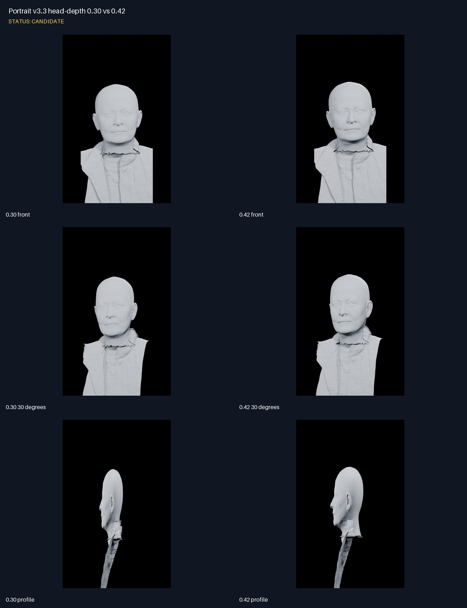
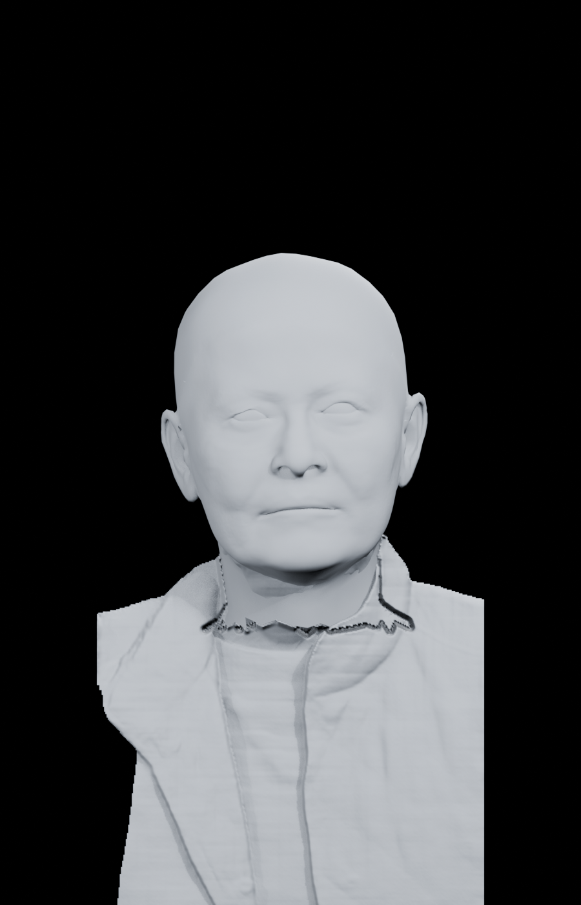
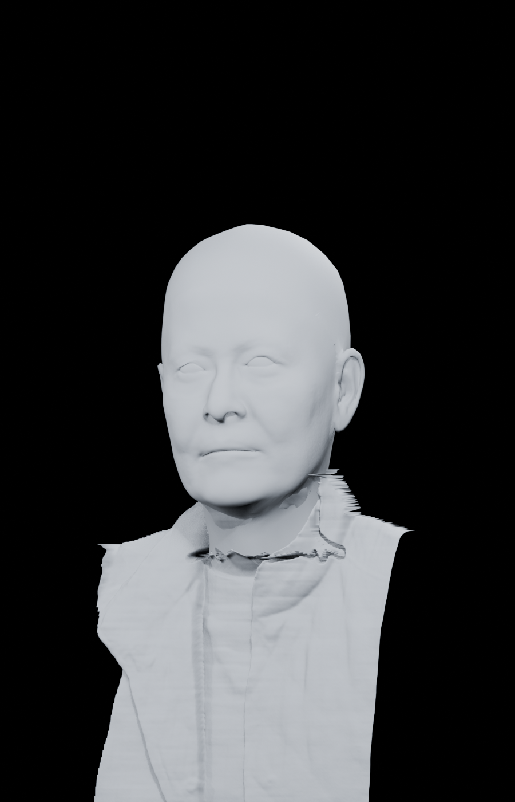
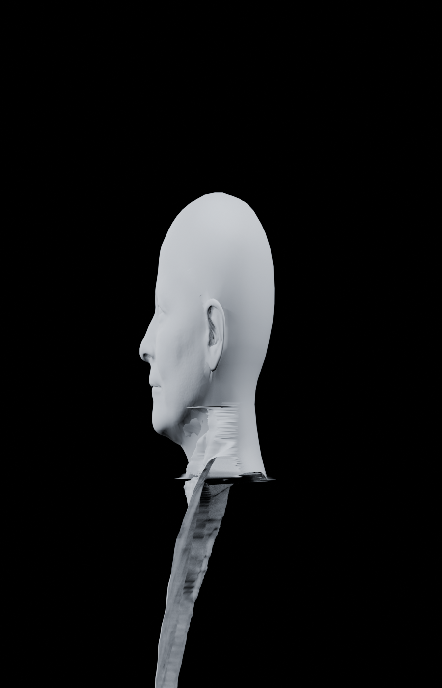

# Portrait v3.3 head-depth 0.30 vs 0.42

Status: **CANDIDATE**

## Notes

- Only the native HRN head-depth span changed from 0.30 to 0.42.
- 0.42 visibly improves cranial depth in profile while retaining the front-facing facial form.
- Neck-to-garment stitching remains experimental and is not accepted.

## 0.30 front

## 0.42 front

## 0.30 30 degrees

## 0.42 30 degrees

## 0.30 profile

## 0.42 profile

