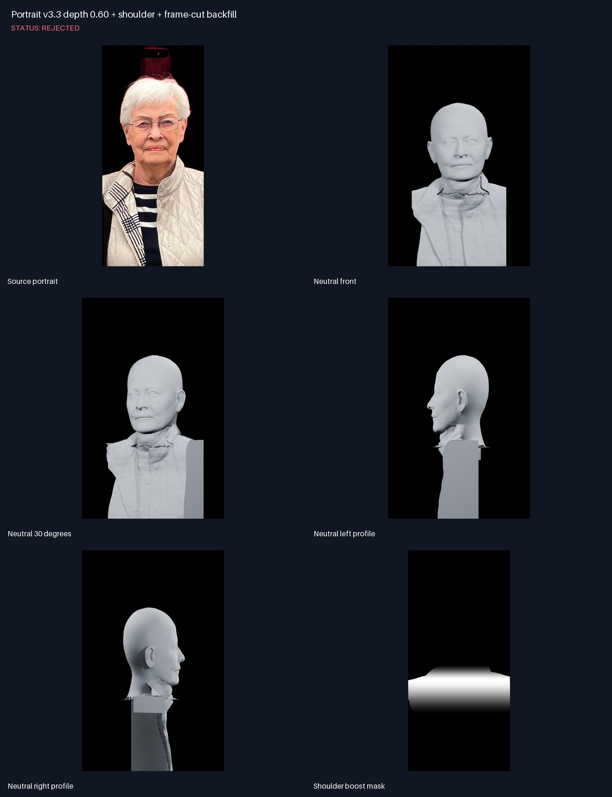
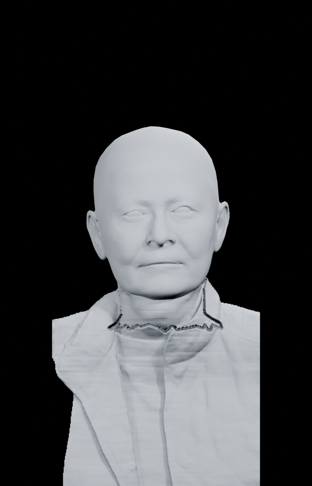
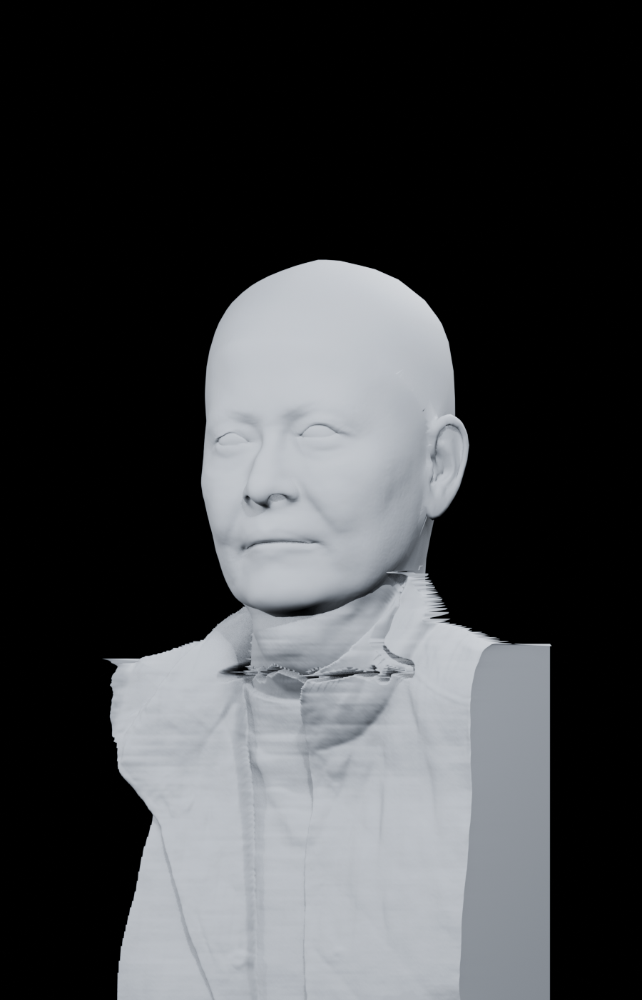
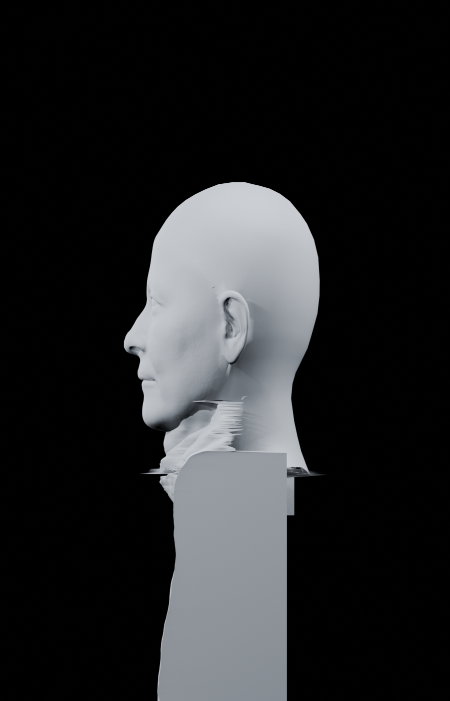
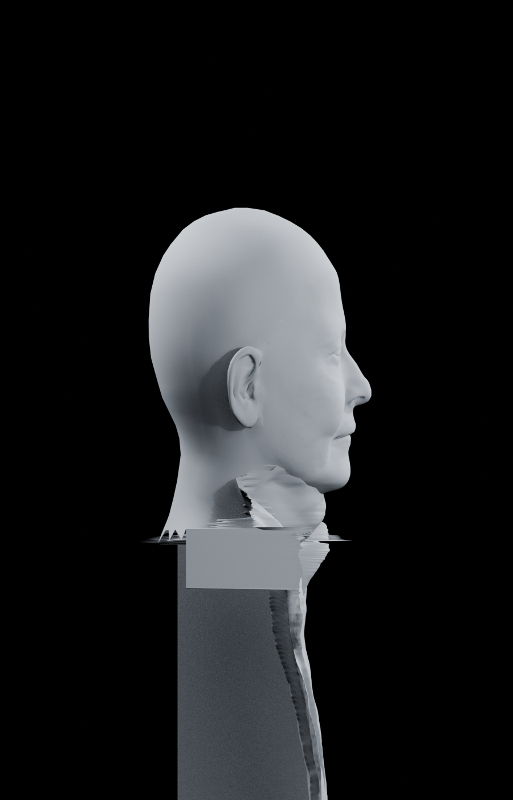

# Portrait v3.3 depth 0.60 + shoulder + frame-cut backfill

Status: **REJECTED**

## Notes

- Rejected by user: the 0.24 frame-cut rear fold makes the naturally thin garment look like a block.
- Head 0.60 and shoulder-only boost remain useful evidence.
- Frame-cut backfill is now opt-in only.

## Source portrait

## Neutral front

## Neutral 30 degrees

## Neutral left profile

## Neutral right profile

## Shoulder boost mask

