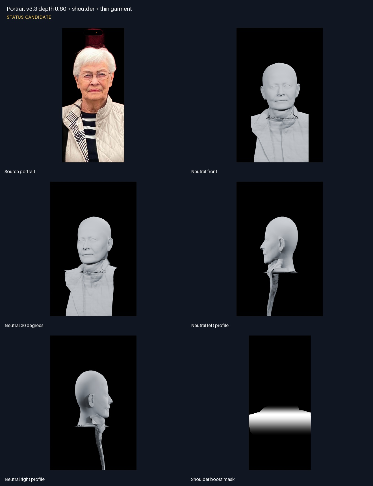
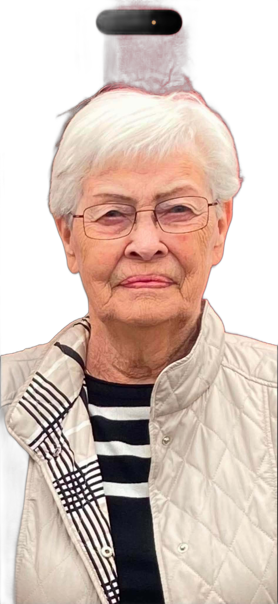
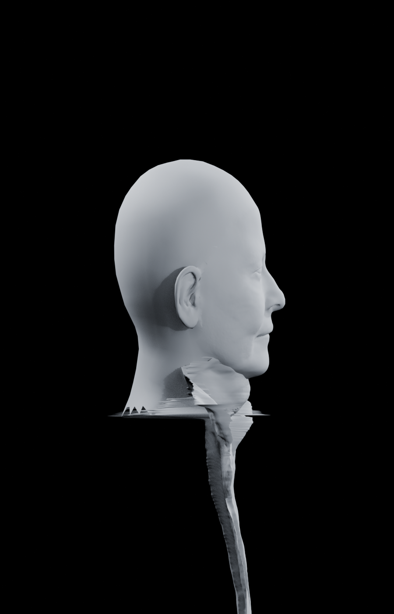

# Portrait v3.3 depth 0.60 + shoulder + thin garment

Status: **CANDIDATE**

## Notes

- Head span 0.60; lower garment remains at 0.26.
- Shoulders alone receive a +0.12 feathered depth boost.
- Frame-cut backfill is disabled.
- Hair, independent glasses geometry, and neck stitching remain pending.

## Source portrait

## Neutral front

## Neutral 30 degrees

## Neutral left profile

## Neutral right profile

## Shoulder boost mask

