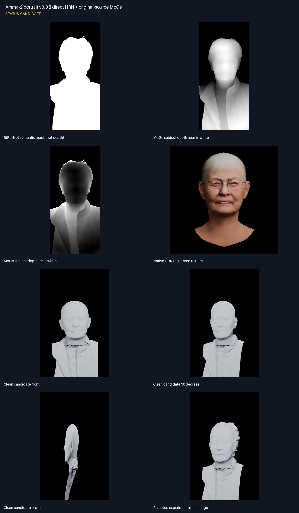
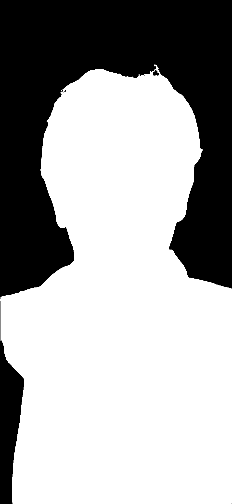
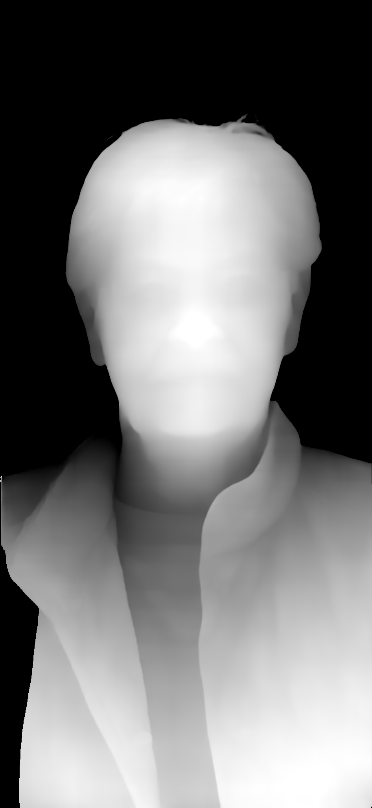
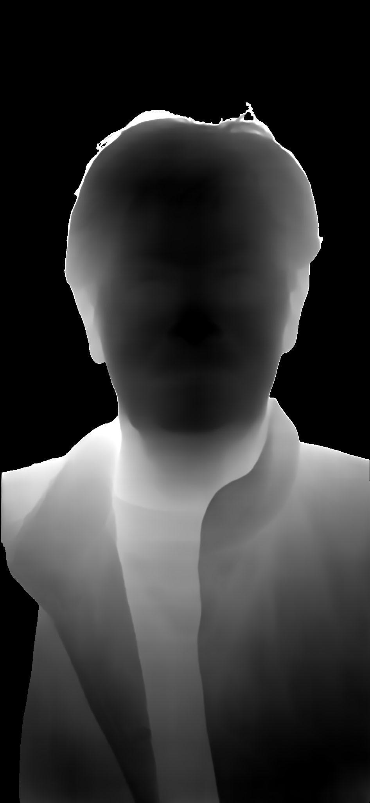
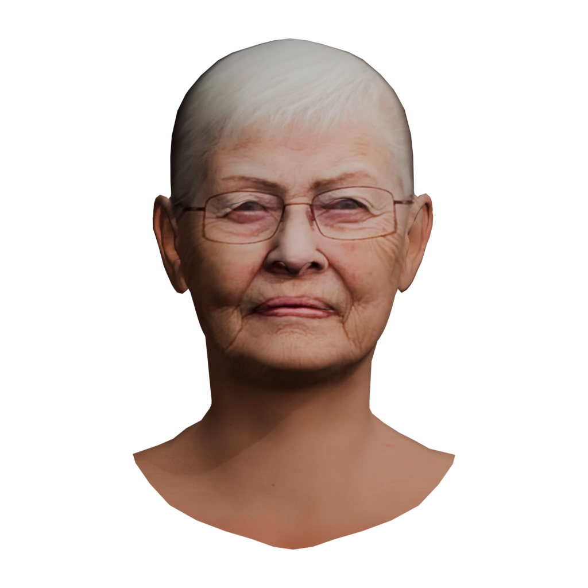
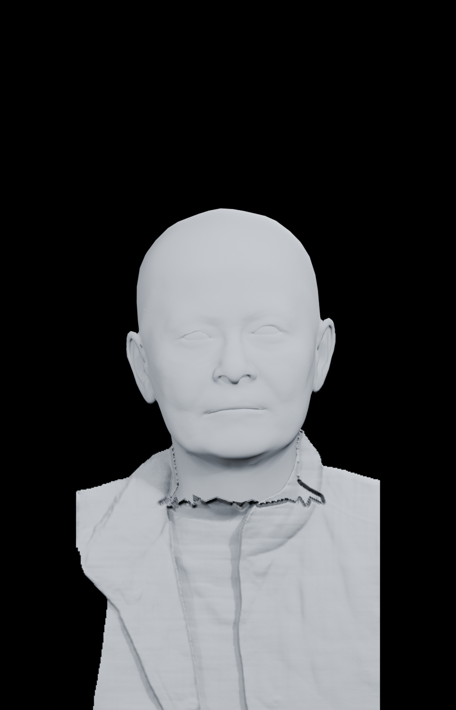
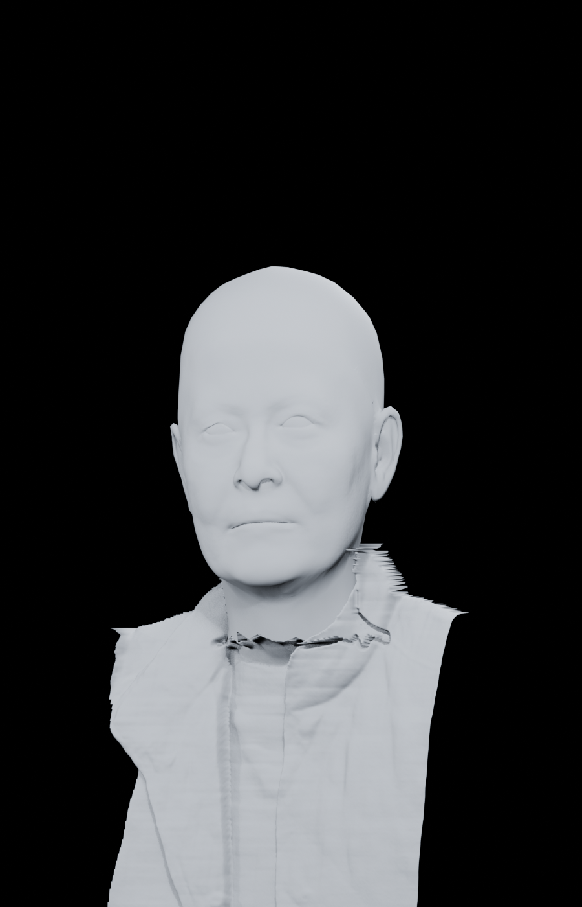
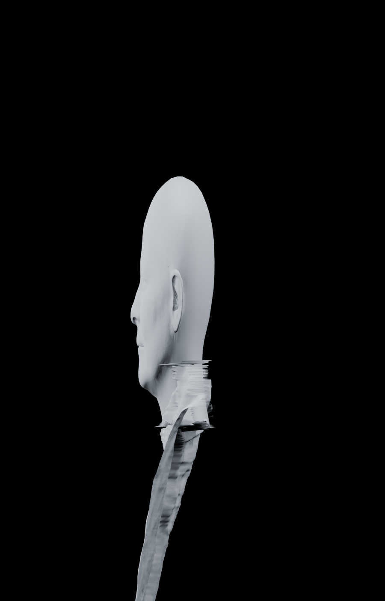
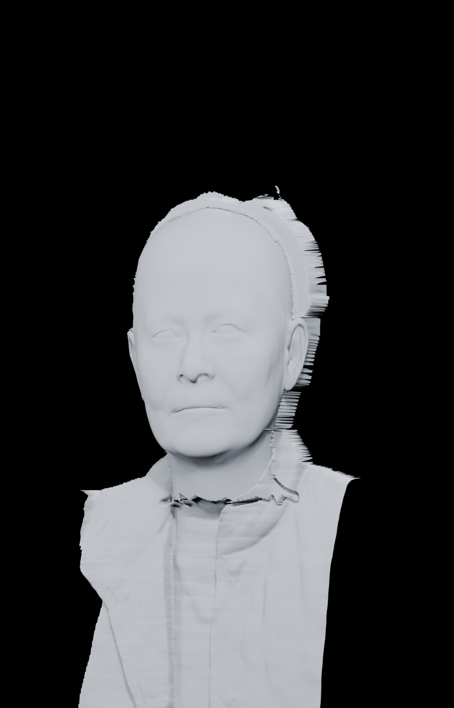

# Amma-2 portrait v3.3 — direct HRN + original-source MoGe

Status: **CANDIDATE**

## Notes

- Candidate, not accepted: the neck-to-garment seam still needs a dedicated stitch/remesh pass.
- BiRefNet produces the binary silhouette only; MoGe-2 ViT-L produces metric depth.
- MoGe was run on the original opaque 2K image and normalized only within the subject mask.
- HRN native topology owns the face and complete shallow head; PARE/ICON/ECON are not used for this close portrait.

## BiRefNet semantic mask (not depth)

## MoGe subject depth near-is-white

## MoGe subject depth far-is-white

## Native HRN registered texture

## Clean candidate front

## Clean candidate 30 degrees

## Clean candidate profile

## Rejected experimental hair fringe

