<!--
File: artifacts/gallery/ac3d-reference/README.md
Purpose:
 - Index the accepted AC3D/Cockpit reference screenshots and decoded GLB QA.
-->

# AC3D Cockpit amma verified reference

Status: **ACCEPTED**

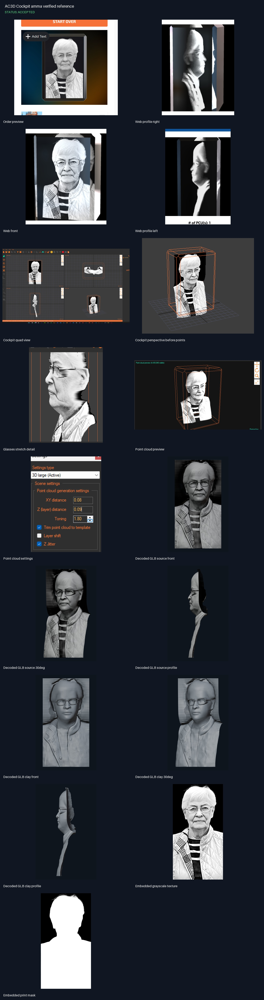

## Notes

- Reference screenshots and independently rebuilt GLB agree in front, 30-degree, and profile views.
- The CI master has 99,614 vertices and 198,063 triangles; the 4,435,041 DXF entries are laser points.
- Source crop edges are authoritative; no new person edges are invented.

## Order preview

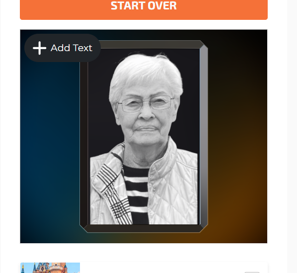

## Web profile right

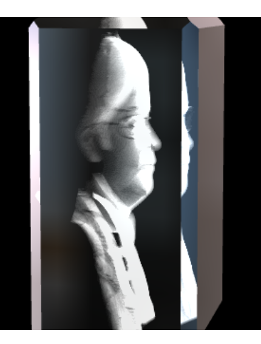

## Web front

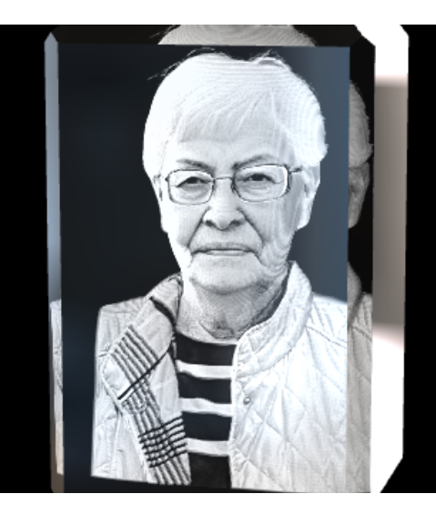

## Web profile left

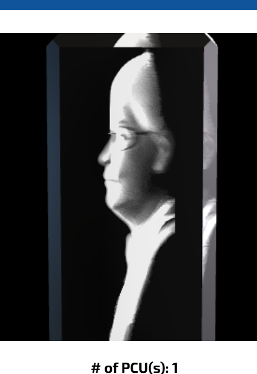

## Cockpit quad view

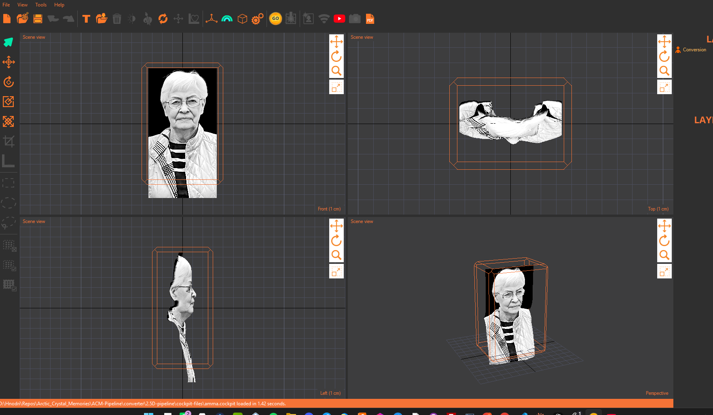

## Cockpit perspective before points

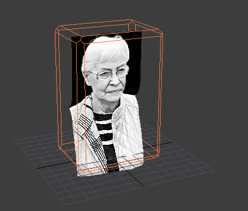

## Glasses stretch detail

## Point cloud preview

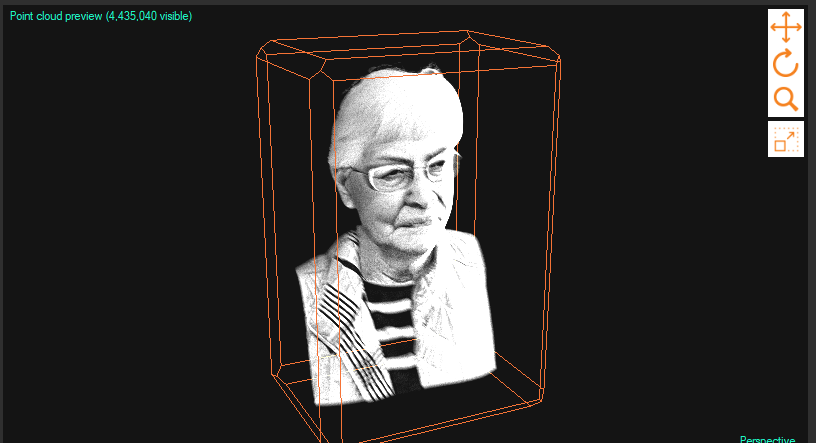

## Point cloud settings

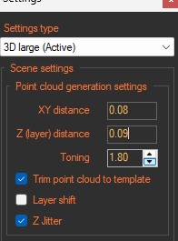

## Decoded GLB source front

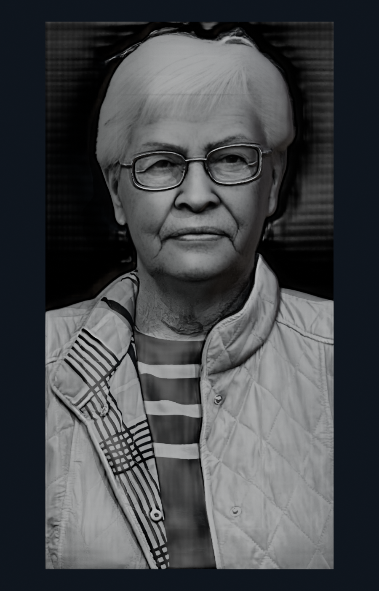

## Decoded GLB source 30deg

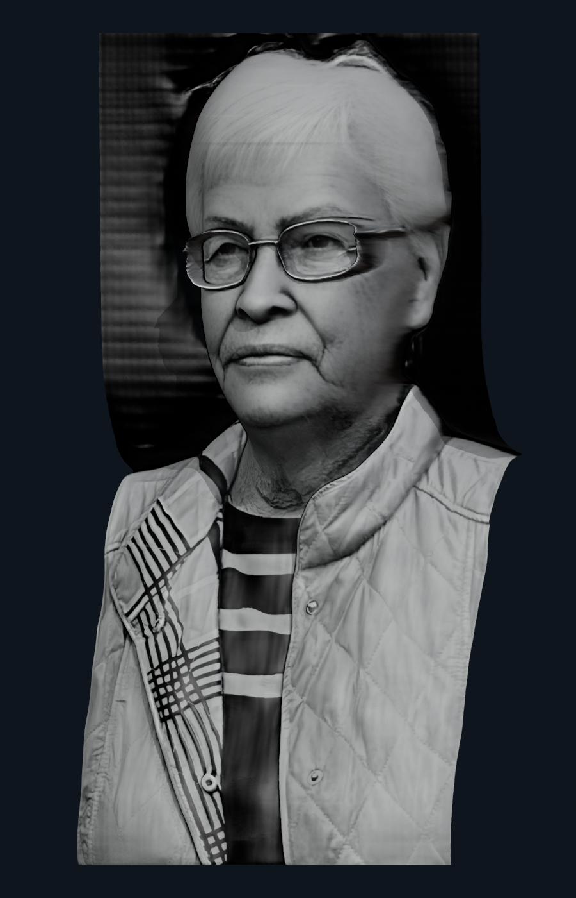

## Decoded GLB source profile

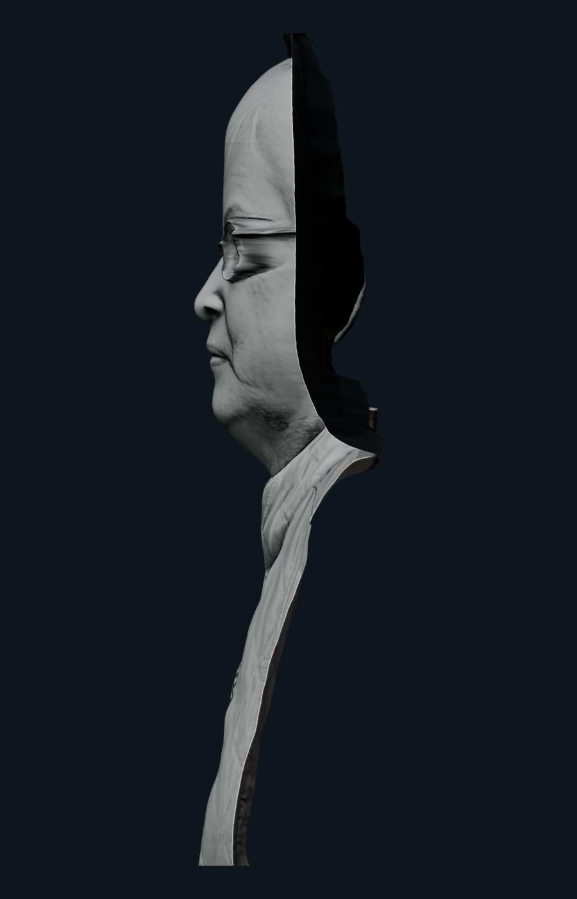

## Decoded GLB clay front

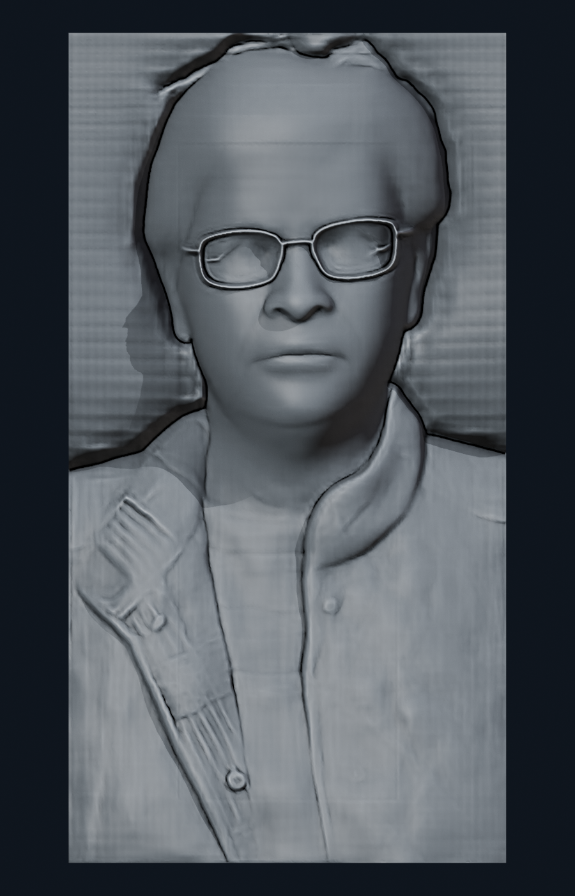

## Decoded GLB clay 30deg

## Decoded GLB clay profile

## Embedded grayscale texture

## Embedded print mask

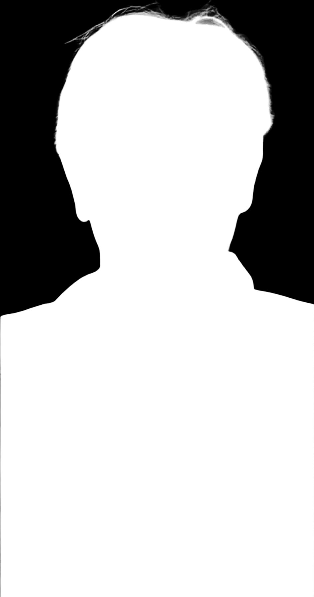
