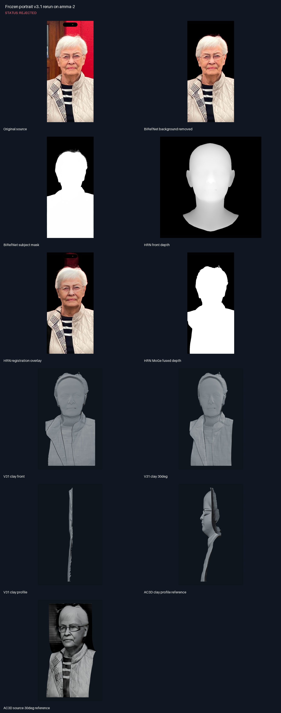
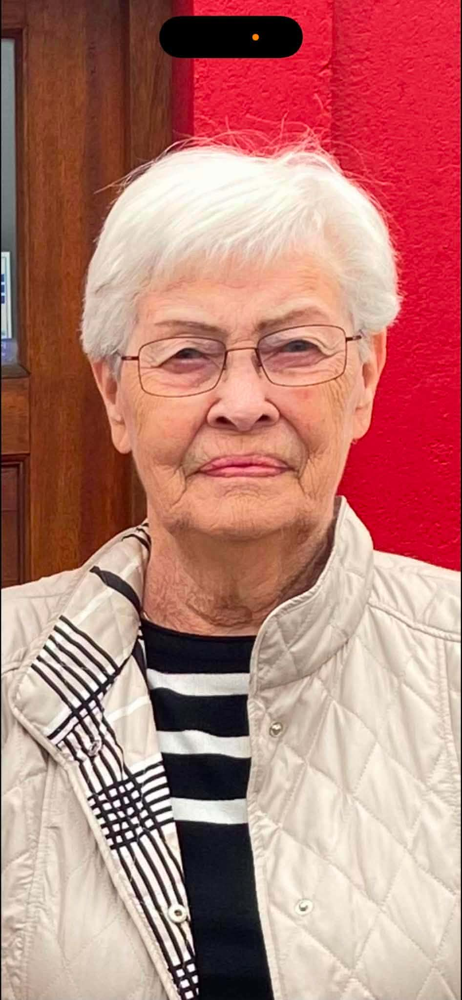
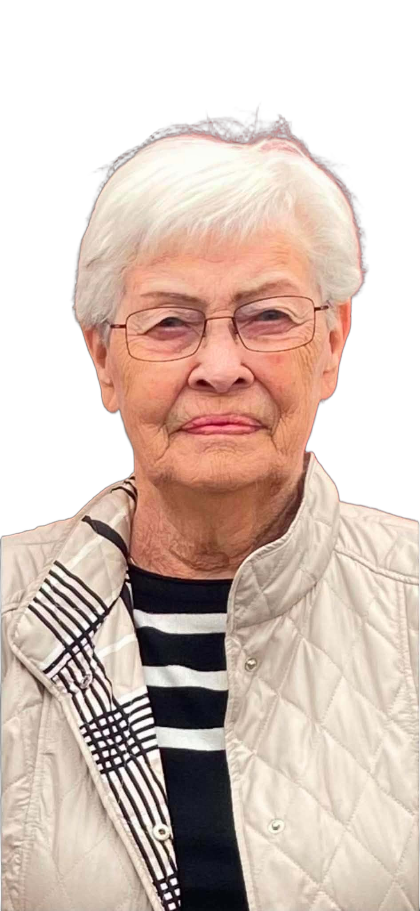
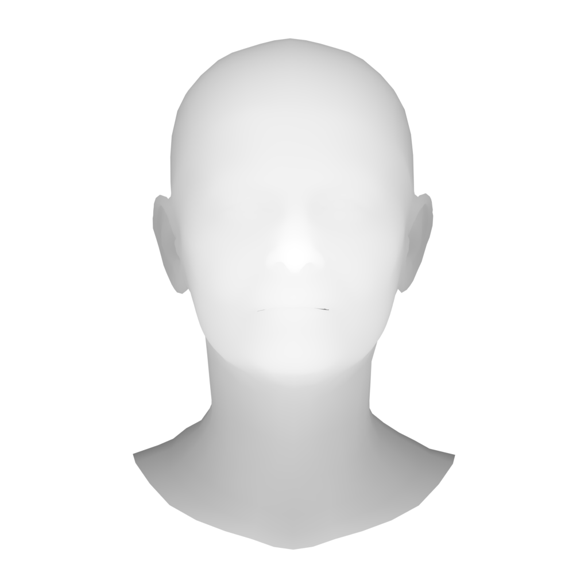
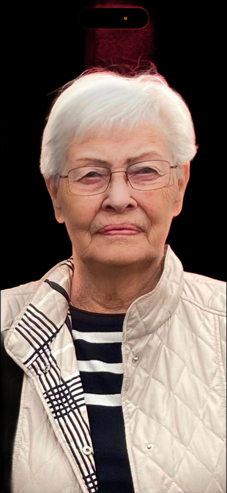
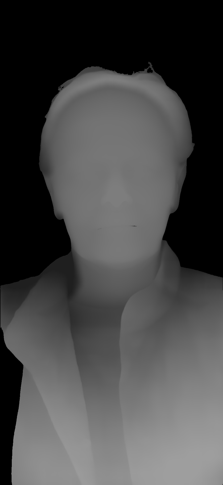
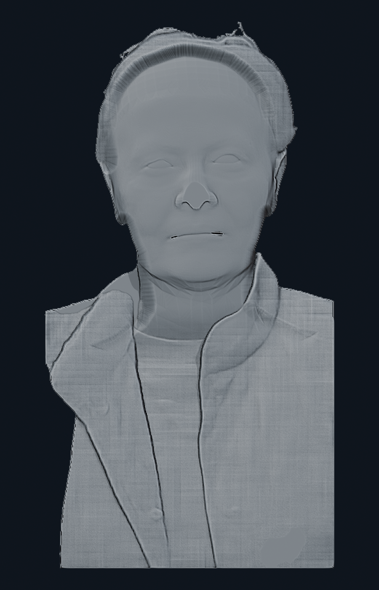
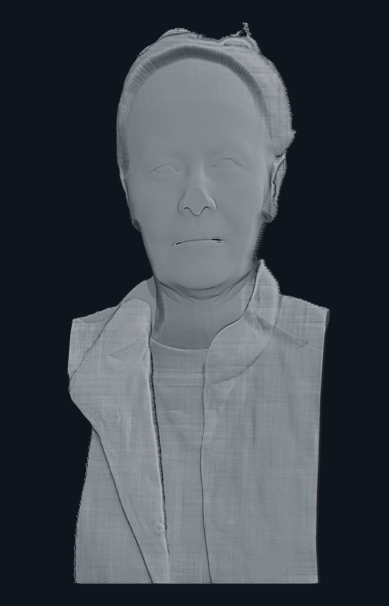
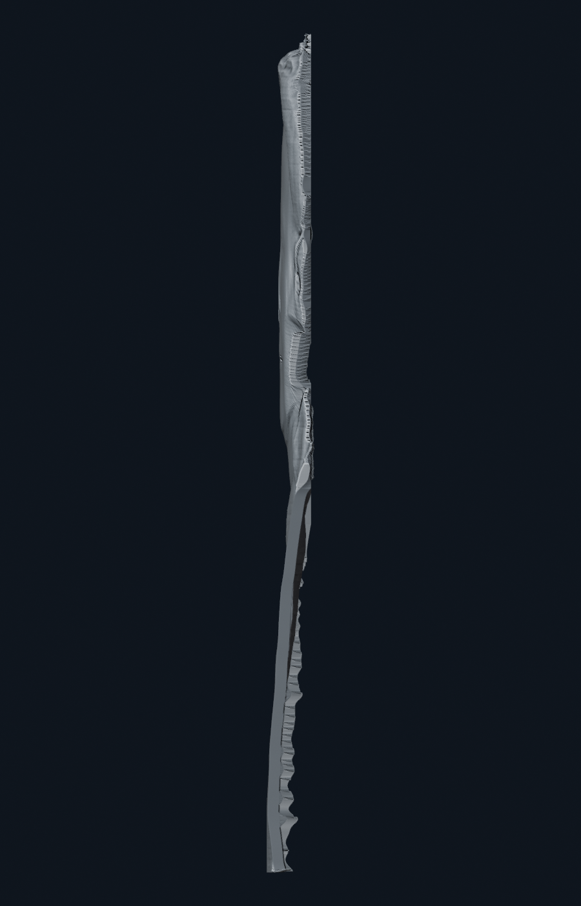
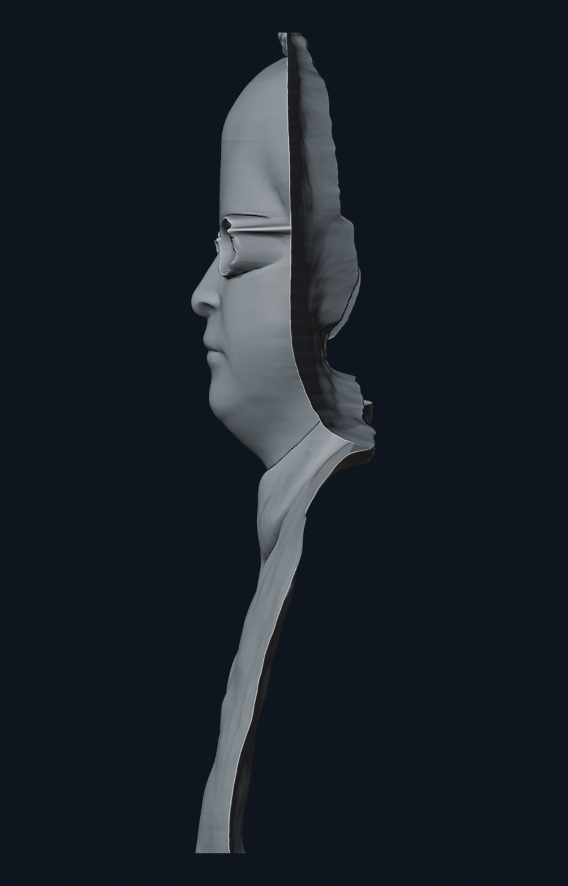

<!--
File: artifacts/gallery/v31-rerun/README.md
Purpose:
 - Index the rejected frozen portrait v3.1 rerun and its AC3D comparison.
-->

# Frozen portrait v3.1 rerun on amma-2

Status: **REJECTED**

## Notes

- The same stored BiRefNet Portrait background-removed input, HRN head, and MoGe depth were used.
- The run is reproducible but the face is flattened, glasses are not real geometry, and the profile is too thin.
- Keep as a negative baseline; do not expose it as the approved self-service portrait preset.

## Original source

## BiRefNet background removed

## BiRefNet subject mask

## HRN front depth

## HRN registration overlay

## HRN MoGe fused depth

## V31 clay front

## V31 clay 30deg

## V31 clay profile

## AC3D clay profile reference

## AC3D source 30deg reference

