<!--
File: generated gallery README.md
Purpose:
 - Index full-resolution images and the contact sheet for one visual research run.
-->

# Amma-2 v3.0 rewind against v3.1-v3.3

Status: **REJECTED**

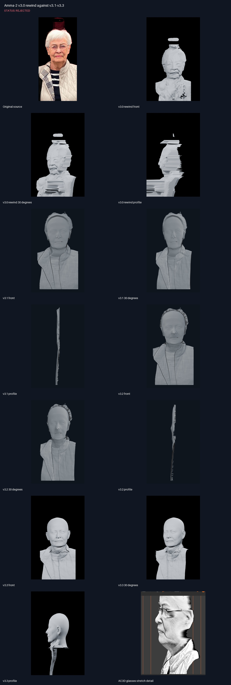

## Notes

- The unchanged v3.0 recipe completed successfully, but the close-portrait geometry is rejected.
- V3.0 preserves strong facial relief and runs the 1,610-edge depth-skirt, but PARE invents full-body structure and the stretched boundary forms horizontal side spikes.
- Glasses remain image/relief evidence rather than a clean independent frame-and-lens geometry layer in every v3.x candidate.
- The AC3D detail is retained as the target behavior for controlled glasses stretching/fill.

## Original source

## v3.0 rewind front

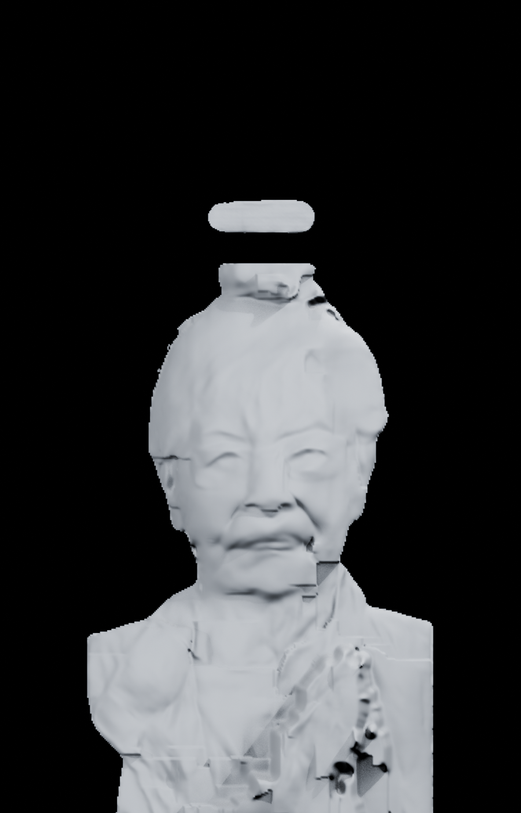

## v3.0 rewind 30 degrees

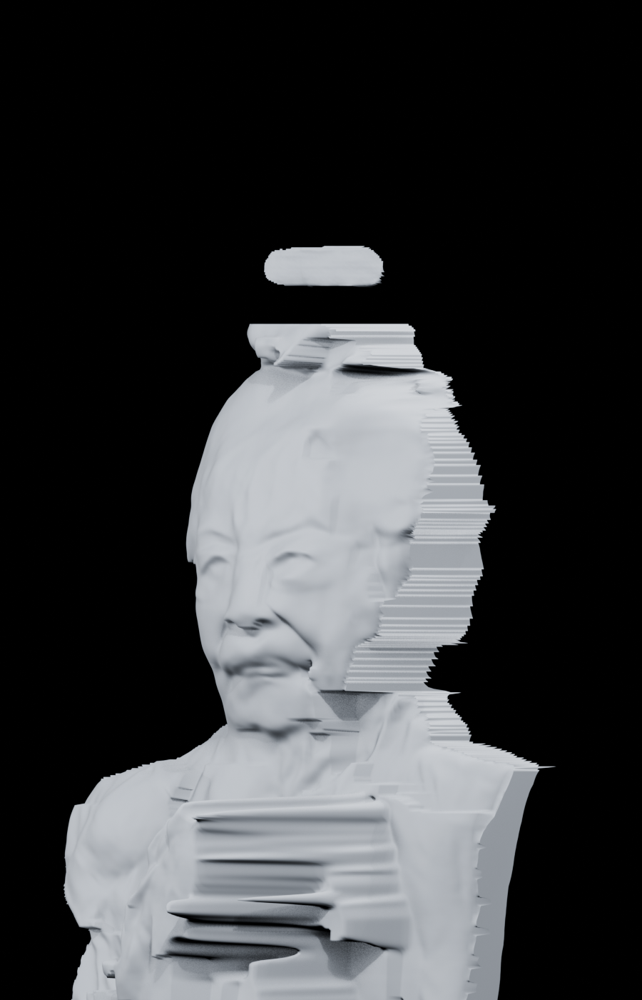

## v3.0 rewind profile

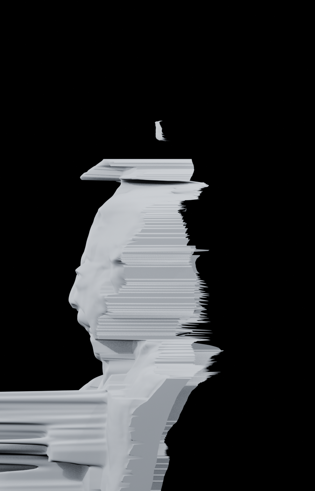

## v3.1 front

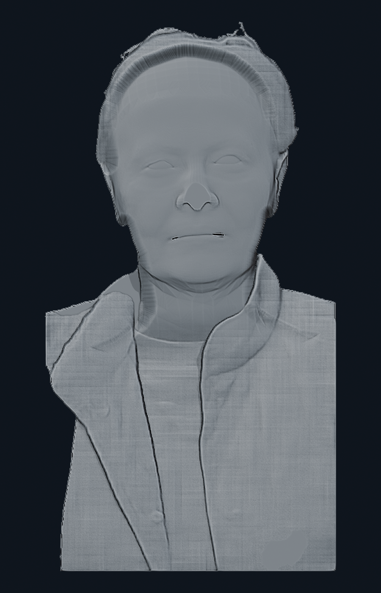

## v3.1 30 degrees

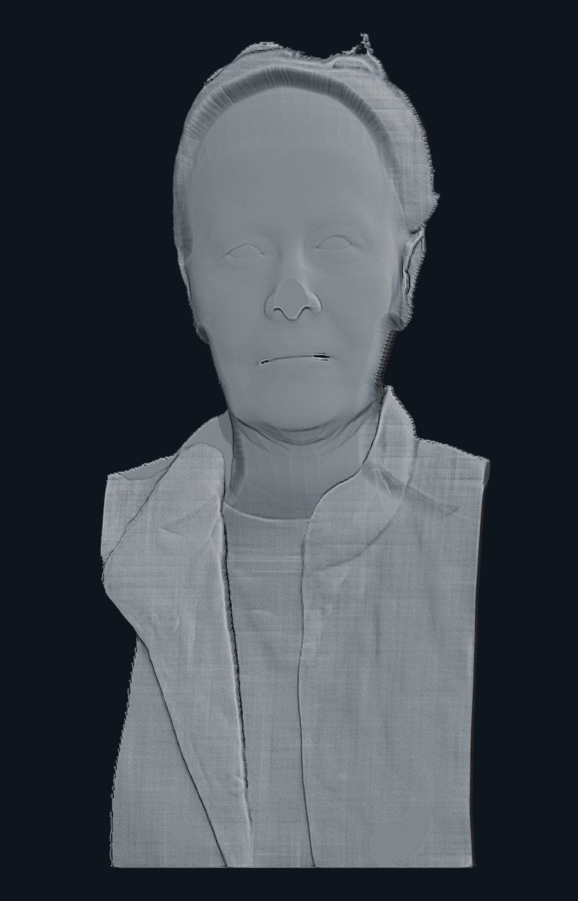

## v3.1 profile

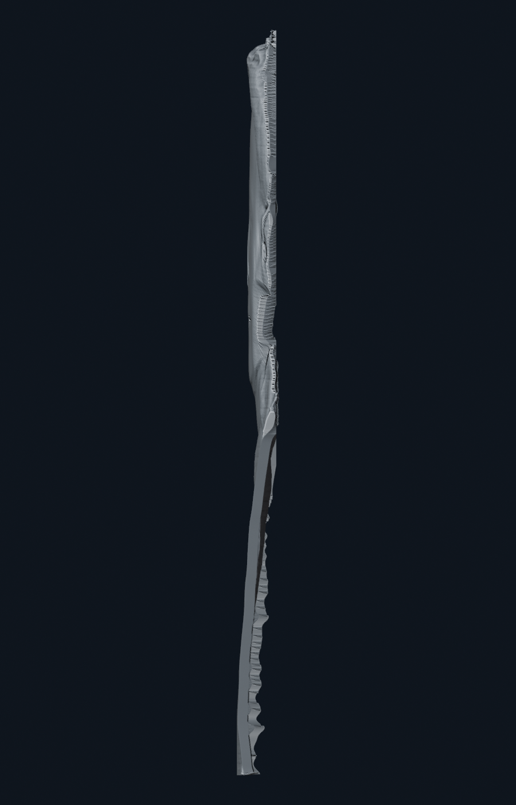

## v3.2 front

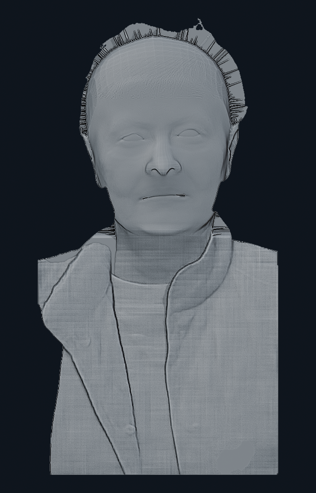

## v3.2 30 degrees

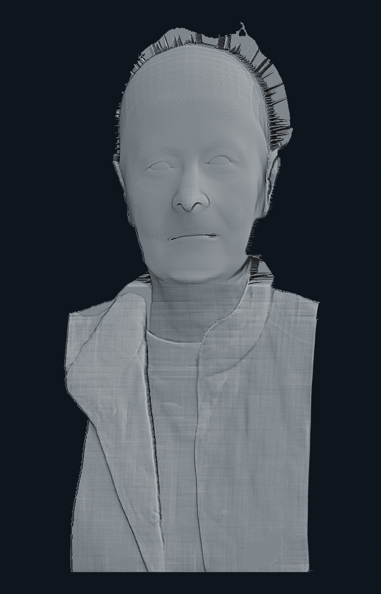

## v3.2 profile

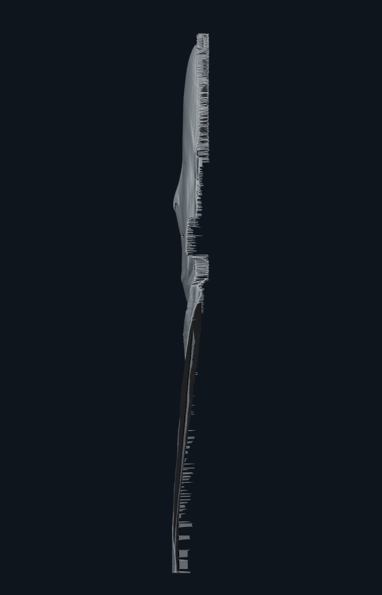

## v3.3 front

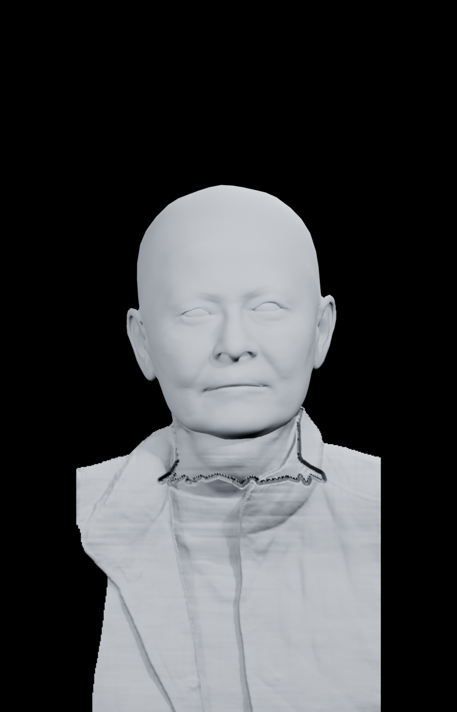

## v3.3 30 degrees

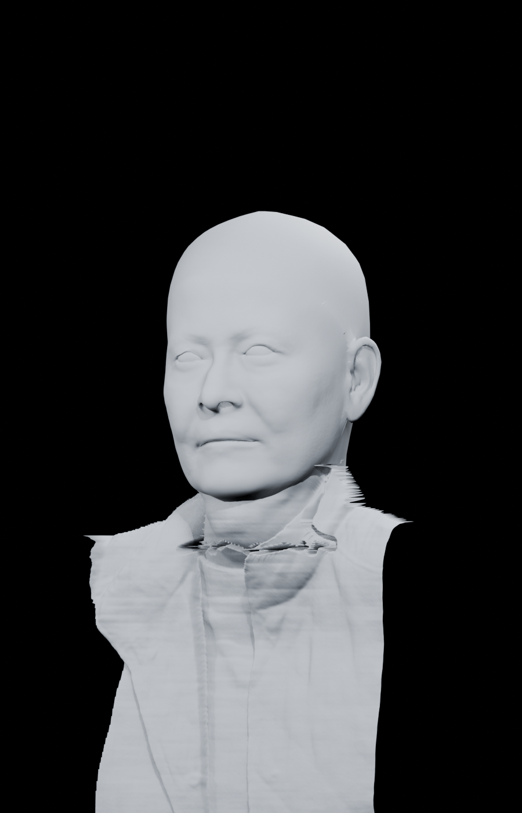

## v3.3 profile

## AC3D glasses stretch detail

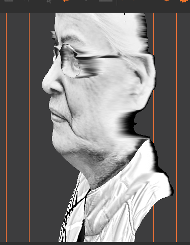
