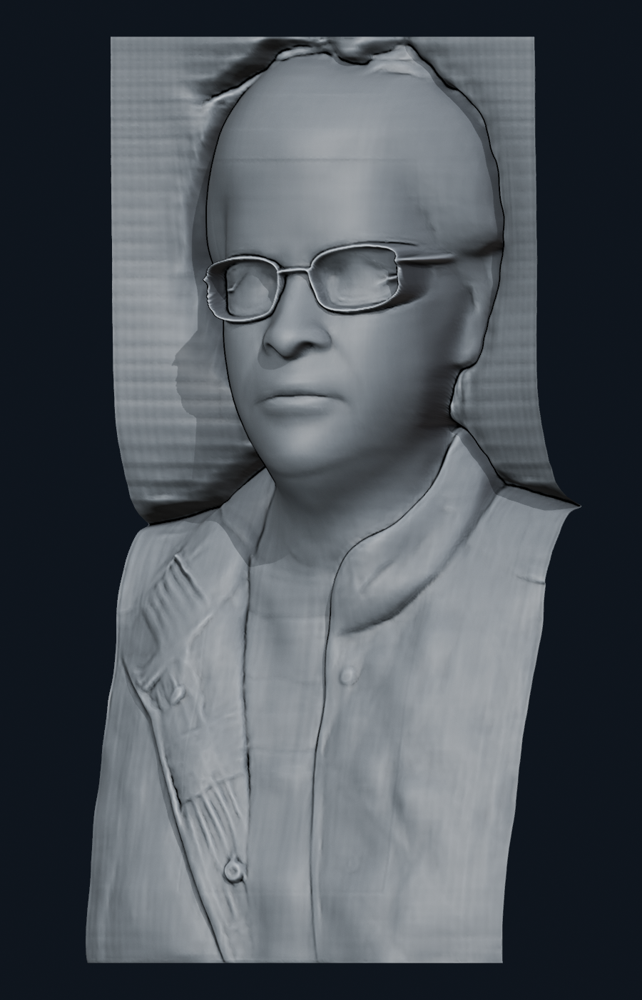
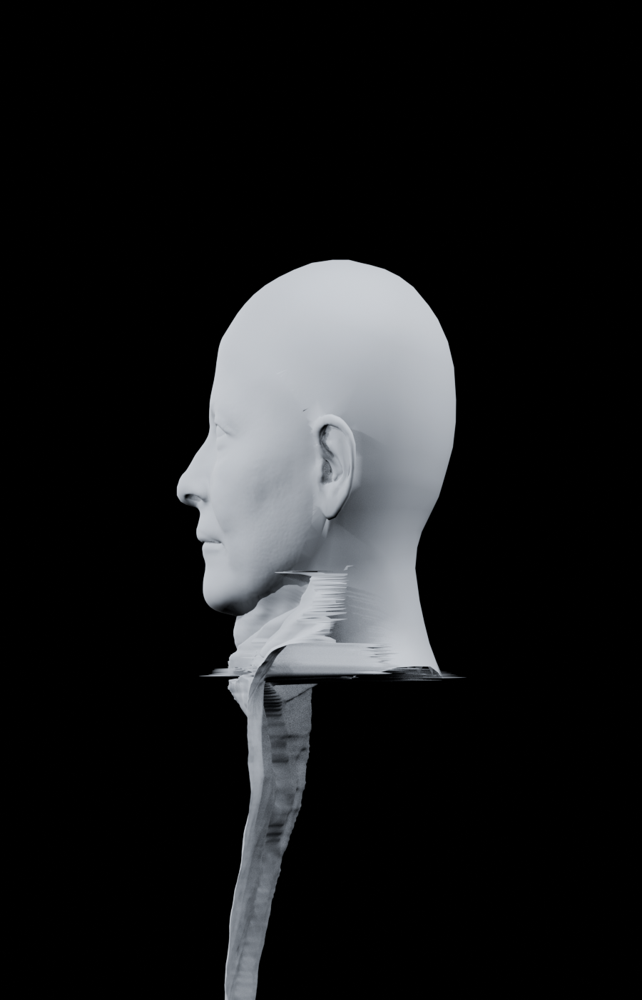
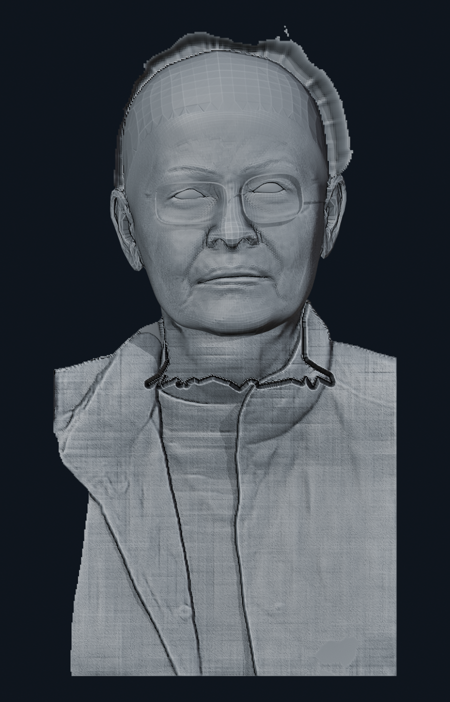
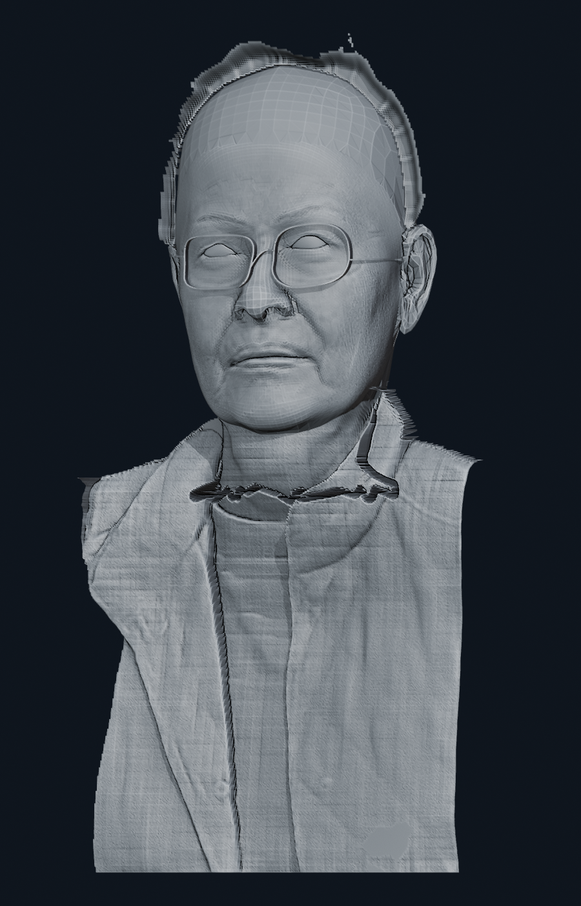
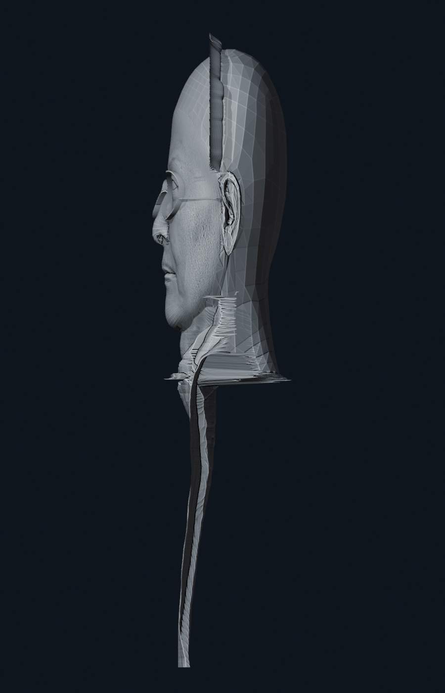
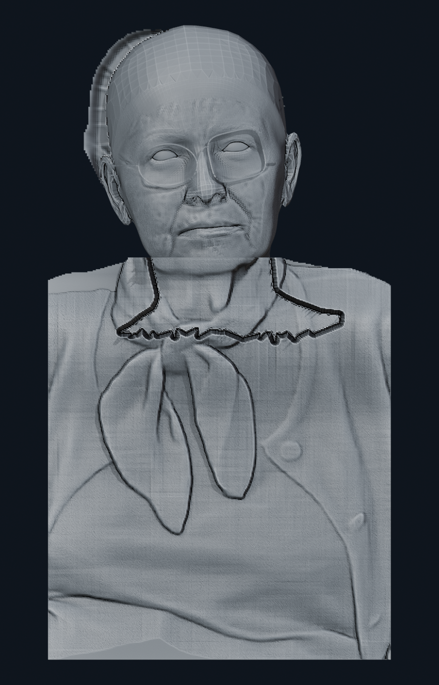
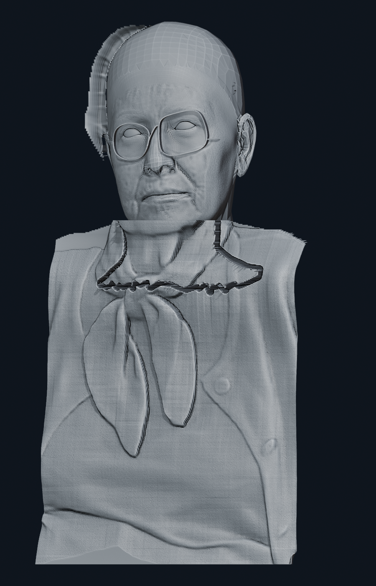
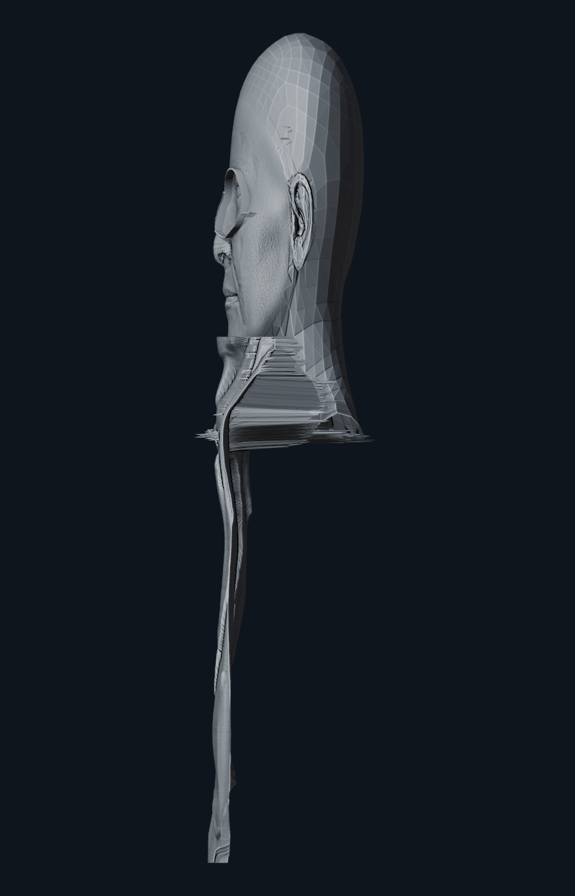
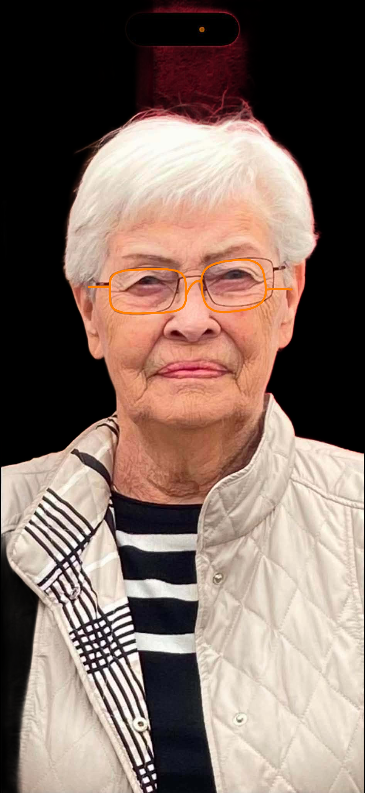
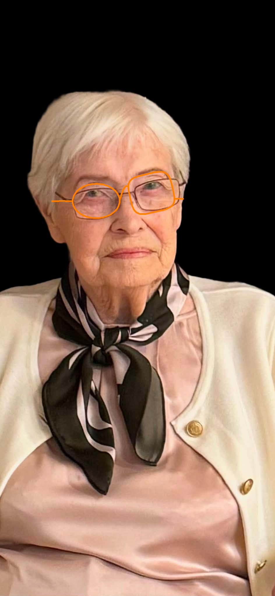

<!--
File: artifacts/gallery/README.md
Purpose:
 - Present the AC3D, v3.3, v3.4 stress-test, and v3.4 control QA evidence.
-->

# Portrait v3.4 samanburðargallerí

Status: **RESEARCH CANDIDATE — seam og hair-profile ekki samþykkt**

## AC3D viðmið

## `amma-2` v3.3 parent

## `amma-2` v3.4 stress test

## `amma-1` v3.4 control

## Source-aligned gleraugna-fit

Orange röndin sýnir miðlínu geometry-rammans; linsusvæðið sjálft helst opið.

